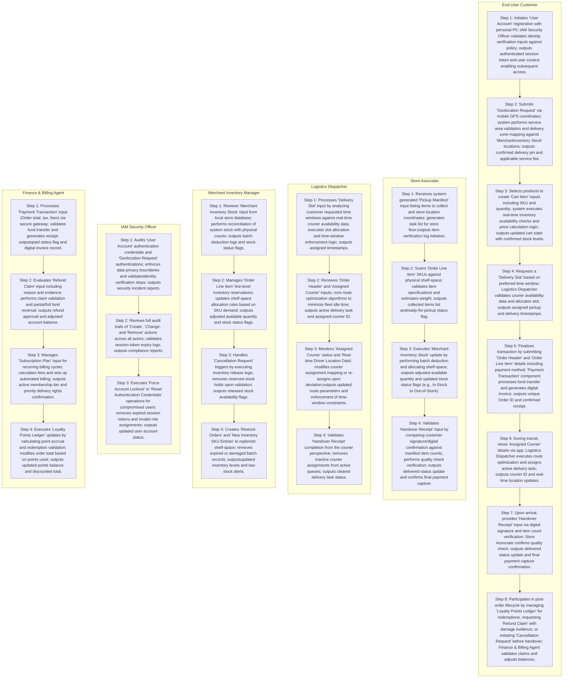

```mermaid
flowchart TD
    subgraph ACTOR_1_End_User_Customer["End-User Customer"]
        direction TB
        ACTOR_1_End_User_Customer_STEP_1["Step 1: Initiates 'User Account' registration with personal PII; IAM Security Officer validates identity verification inputs against policy; outputs authenticated session token and user context enabling subsequent access."]
        ACTOR_1_End_User_Customer_STEP_2["Step 2: Submits 'Geolocation Request' via mobile GPS coordinates; system performs service area validation and delivery zone mapping against 'MerchantInventory Stock' locations; outputs confirmed delivery pin and applicable service fee."]
        ACTOR_1_End_User_Customer_STEP_3["Step 3: Selects products to create 'Cart Item' inputs including SKU and quantity; system executes real-time inventory availability checks and price calculation logic; outputs updated cart state with confirmed stock levels."]
        ACTOR_1_End_User_Customer_STEP_4["Step 4: Requests a 'Delivery Slot' based on preferred time window; Logistics Dispatcher validates courier availability data and allocates slot; outputs assigned pickup and delivery timestamps."]
        ACTOR_1_End_User_Customer_STEP_5["Step 5: Finalizes transaction by submitting 'Order Header' and 'Order Line Item' details including payment method; 'Payment Transaction' component processes fund transfer and generates digital invoice; outputs unique Order ID and confirmed receipt."]
        ACTOR_1_End_User_Customer_STEP_6["Step 6: During transit, views 'Assigned Courier' details via app; Logistics Dispatcher executes route optimization and assigns active delivery task; outputs courier ID and real-time location updates."]
        ACTOR_1_End_User_Customer_STEP_7["Step 7: Upon arrival, provides 'Handover Receipt' input via digital signature and item count verification; Store Associate confirms quality check; outputs delivered status update and final payment capture confirmation."]
        ACTOR_1_End_User_Customer_STEP_8["Step 8: Participates in post-order lifecycle by managing 'Loyalty Points Ledger' for redemptions, requesting 'Refund Claim' with damage evidence, or initiating 'Cancellation Request' before handover; Finance & Billing Agent validates claims and adjusts balances."]
        ACTOR_1_End_User_Customer_STEP_1 --> ACTOR_1_End_User_Customer_STEP_2
        ACTOR_1_End_User_Customer_STEP_2 --> ACTOR_1_End_User_Customer_STEP_3
        ACTOR_1_End_User_Customer_STEP_3 --> ACTOR_1_End_User_Customer_STEP_4
        ACTOR_1_End_User_Customer_STEP_4 --> ACTOR_1_End_User_Customer_STEP_5
        ACTOR_1_End_User_Customer_STEP_5 --> ACTOR_1_End_User_Customer_STEP_6
        ACTOR_1_End_User_Customer_STEP_6 --> ACTOR_1_End_User_Customer_STEP_7
        ACTOR_1_End_User_Customer_STEP_7 --> ACTOR_1_End_User_Customer_STEP_8
    end
    subgraph ACTOR_2_Store_Associate["Store Associate"]
        direction TB
        ACTOR_2_Store_Associate_STEP_1["Step 1: Receives system-generated 'Pickup Manifest' input listing items to collect and store location coordinates; generates task list for store floor;outputs item verification log initiation."]
        ACTOR_2_Store_Associate_STEP_2["Step 2: Scans 'Order Line Item' SKUs against physical shelf-space; validates item specifications and estimates weight; outputs collected items list andready-for-pickup status flag."]
        ACTOR_2_Store_Associate_STEP_3["Step 3: Executes 'Merchant Inventory Stock' update by performing batch deduction and allocating shelf-space; outputs adjusted available quantity and updated stock status flags (e.g., In-Stock to Out-of-Stock)."]
        ACTOR_2_Store_Associate_STEP_4["Step 4: Validates 'Handover Receipt' input by comparing customer signature/digital confirmation against manifest item counts; performs quality check verification; outputs delivered status update and confirms final payment capture."]
        ACTOR_2_Store_Associate_STEP_1 --> ACTOR_2_Store_Associate_STEP_2
        ACTOR_2_Store_Associate_STEP_2 --> ACTOR_2_Store_Associate_STEP_3
        ACTOR_2_Store_Associate_STEP_3 --> ACTOR_2_Store_Associate_STEP_4
    end
    subgraph ACTOR_3_Logistics_Dispatcher["Logistics Dispatcher"]
        direction TB
        ACTOR_3_Logistics_Dispatcher_STEP_1["Step 1: Processes 'Delivery Slot' input by analyzing customer requested time windows against real-time courier availability data; executes slot allocation and time-window enforcement logic; outputs assigned timestamps."]
        ACTOR_3_Logistics_Dispatcher_STEP_2["Step 2: Receives 'Order Header' and 'Assigned Courier' inputs; runs route optimization algorithms to minimize fleet idle time; outputs active delivery task and assigned courier ID."]
        ACTOR_3_Logistics_Dispatcher_STEP_3["Step 3: Monitors 'Assigned Courier' status and 'Real-time Driver Location Data'; modifies courier assignment mapping or re-assigns upon deviation;outputs updated route parameters and enforcement of time-window constraints."]
        ACTOR_3_Logistics_Dispatcher_STEP_4["Step 4: Validates 'Handover Receipt' completion from the courier perspective; removes inactive courier assignments from active queues; outputs cleared delivery task status."]
        ACTOR_3_Logistics_Dispatcher_STEP_1 --> ACTOR_3_Logistics_Dispatcher_STEP_2
        ACTOR_3_Logistics_Dispatcher_STEP_2 --> ACTOR_3_Logistics_Dispatcher_STEP_3
        ACTOR_3_Logistics_Dispatcher_STEP_3 --> ACTOR_3_Logistics_Dispatcher_STEP_4
    end
    subgraph ACTOR_4_Merchant_Inventory_Manager["Merchant Inventory Manager"]
        direction TB
        ACTOR_4_Merchant_Inventory_Manager_STEP_1["Step 1: Reviews 'Merchant Inventory Stock' input from local store database; performs reconciliation of system stock with physical counts; outputs batch deduction logs and stock status flags."]
        ACTOR_4_Merchant_Inventory_Manager_STEP_2["Step 2: Manages 'Order Line Item' line-level inventory reservations; updates shelf-space allocation rules based on SKU demand; outputs adjusted available quantity and stock status flags."]
        ACTOR_4_Merchant_Inventory_Manager_STEP_3["Step 3: Handles 'Cancellation Request' triggers by executing inventory release logic; removes reserved stock holds upon validation; outputs released stock availability flags."]
        ACTOR_4_Merchant_Inventory_Manager_STEP_4["Step 4: Creates 'Restock Orders' and 'New Inventory SKU Entries' to replenish shelf-space; removes expired or damaged batch records; outputsupdated inventory levels and low-stock alerts."]
        ACTOR_4_Merchant_Inventory_Manager_STEP_1 --> ACTOR_4_Merchant_Inventory_Manager_STEP_2
        ACTOR_4_Merchant_Inventory_Manager_STEP_2 --> ACTOR_4_Merchant_Inventory_Manager_STEP_3
        ACTOR_4_Merchant_Inventory_Manager_STEP_3 --> ACTOR_4_Merchant_Inventory_Manager_STEP_4
    end
    subgraph ACTOR_5_IAM_Security_Officer["IAM Security Officer"]
        direction TB
        ACTOR_5_IAM_Security_Officer_STEP_1["Step 1: Audits 'User Account' authentication credentials and 'Geolocation Request' authentications; enforces data privacy boundaries and validatesidentity verification steps; outputs security incident reports."]
        ACTOR_5_IAM_Security_Officer_STEP_2["Step 2: Reviews full audit trails of 'Create', 'Change', and 'Remove' actions across all actors; validates session token expiry logs; outputs compliance reports."]
        ACTOR_5_IAM_Security_Officer_STEP_3["Step 3: Executes 'Force Account Lockout' or 'Reset Authentication Credentials' operations for compromised users; removes expired session tokens and invalid role assignments; outputs updated user account status."]
        ACTOR_5_IAM_Security_Officer_STEP_1 --> ACTOR_5_IAM_Security_Officer_STEP_2
        ACTOR_5_IAM_Security_Officer_STEP_2 --> ACTOR_5_IAM_Security_Officer_STEP_3
    end
    subgraph ACTOR_6_Finance_Billing_Agent["Finance & Billing Agent"]
        direction TB
        ACTOR_6_Finance_Billing_Agent_STEP_1["Step 1: Processes 'Payment Transaction' input (Order total, tax, fees) via secure gateway; validates fund transfer and generates receipt; outputspaid status flag and digital invoice record."]
        ACTOR_6_Finance_Billing_Agent_STEP_2["Step 2: Evaluates 'Refund Claim' input including reason and evidence; performs claim validation and partial/full fund reversal; outputs refund approval and adjusted account balance."]
        ACTOR_6_Finance_Billing_Agent_STEP_3["Step 3: Manages 'Subscription Plan' input for recurring billing cycles; calculates fees and sets up automated billing; outputs active membership tier and priority delivery rights confirmation."]
        ACTOR_6_Finance_Billing_Agent_STEP_4["Step 4: Executes 'Loyalty Points Ledger' updates by calculating point accrual and redemption validation; modifies order total based on points used; outputs updated points balance and discounted total."]
        ACTOR_6_Finance_Billing_Agent_STEP_1 --> ACTOR_6_Finance_Billing_Agent_STEP_2
        ACTOR_6_Finance_Billing_Agent_STEP_2 --> ACTOR_6_Finance_Billing_Agent_STEP_3
        ACTOR_6_Finance_Billing_Agent_STEP_3 --> ACTOR_6_Finance_Billing_Agent_STEP_4
    end
```