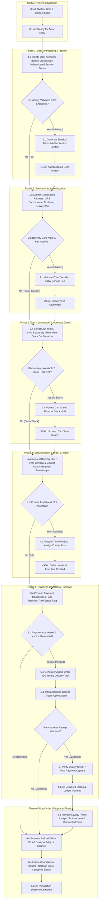

```mermaid
graph TD
    %% GLOBAL INITIALIZATION
    subgraph global_init [Global: System Initialization]
        node_root_init["0 Init: System Boot & Context Load"]
        node_init_hub["0.Hub: Ready for Actor Entry"]
    end

    %% PHASE 01: USER ONBOARDING & AUTHORIZATION
    subgraph phase_01 [Phase 1: User Onboarding & Identity]
        node_1a["1.a Initiate User Account / Identity Verification / Authenticated Session Token"]
        decision_1b{"1.b Identity Validated & PII Encrypted?"}
        node_1c["1.c Generate Session Token / Authenticated Context"]
        node_1_exit_hub["1.Exit: Authenticated User Ready"]
    end

    %% PHASE 02: SERVICE ZONE & GEOLOCATION
    subgraph phase_02 [Phase 2: Service Area & Geolocation]
        node_2a["2.a Submit Geolocation Request / GPS Coordinates / Confirmed Delivery Pin"]
        decision_2b{"2.b Delivery Zone Valid & Fee Applied?"}
        node_2c["2.c Validate Zone Bounds / Apply Service Fee"]
        node_2_exit_hub["2.Exit: Delivery Pin Confirmed"]
    end

    %% PHASE 03: CART CONSTRUCTION & INVENTORY
    subgraph phase_03 [Phase 3: Cart Construction & Inventory Check]
        node_3a["3.a Select Cart Items / SKU & Quantity / Real-time Stock Confirmation"]
        decision_3b{"3.b Inventory Available & Stock Reserved?"}
        node_3c["3.c Update Cart State / Reserve Stock Hold"]
        node_3_exit_hub["3.Exit: Updated Cart State Ready"]
    end

    %% PHASE 04: SLOT ALLOCATION & ORDER CREATION
    subgraph phase_04 [Phase 4: Slot Allocation & Order Creation]
        node_4a["4.a Request Delivery Slot / Time Window & Courier Data / Assigned Timestamps"]
        decision_4b{"4.b Courier Available & Slot Allocated?"}
        node_4c["4.c Allocate Time Window / Assign Courier Task"]
        node_4_exit_hub["4.Exit: Order Header & Line Item Created"]
    end

    %% PHASE 05: PAYMENT, DISPATCH & HANDOVER
    subgraph phase_05 [Phase 5: Payment, Dispatch & Handover]
        node_5a["5.a Process Payment Transaction / Fund Transfer / Paid Status Flag"]
        decision_5b{"5.b Payment Authorized & Invoice Generated?"}
        node_5c["5.c Generate Unique Order ID / Initiate Delivery Task"]
        node_5d["5.d Track Assigned Courier / Route Optimization"]
        decision_5e{"5.e Handover Receipt Validated?"}
        node_5f["5.f Verify Quality Check / Final Payment Capture"]
        node_5_exit_hub["5.Exit: Delivered Status & Ledger Updated"]
    end

    %% PHASE 06: POST-ORDER & FINANCIALS
    subgraph phase_06 [Phase 6: Post-Order Lifecycle & Finance]
        node_6a["6.a Manage Loyalty Points Ledger / Point Accrual / Discounted Total"]
        node_6b["6.b Evaluate Refund Claim / Fund Reversal / Adjust Balance"]
        node_6c["6.c Initiate Cancellation Request / Release Stock / Cancelled Status"]
        node_6_exit_hub["6.Exit: Transaction Lifecycle Complete"]
    end

    %% --- CONNECTIONS & FLOWS ---

    %% Global to Phase 1
    node_root_init --> node_init_hub
    node_init_hub --> node_1a

    %% Phase 1: User Onboarding
    node_1a --> decision_1b
    decision_1b -- "Yes (Validated)" --> node_1c
    decision_1b -- "No (Fail)" --> node_2a
    node_1c --> node_1_exit_hub

    %% Phase 2: Geolocation
    node_1_exit_hub --> node_2a
    node_2a --> decision_2b
    decision_2b -- "Yes (Validated)" --> node_2c
    decision_2b -- "No (Out of Bounds)" --> node_3a
    node_2c --> node_2_exit_hub

    %% Phase 3: Cart & Inventory
    node_2_exit_hub --> node_3a
    node_3a --> decision_3b
    decision_3b -- "Yes (In Stock)" --> node_3c
    decision_3b -- "No (Out of Stock)" --> node_4a
    node_3c --> node_3_exit_hub

    %% Phase 4: Slots & Orders
    node_3_exit_hub --> node_4a
    node_4a --> decision_4b
    decision_4b -- "Yes (Available)" --> node_4c
    decision_4b -- "No (Full)" --> node_5a
    node_4c --> node_4_exit_hub

    %% Phase 5: Payment & Dispatch
    node_4_exit_hub --> node_5a
    node_5a --> decision_5b
    decision_5b -- "Yes (Authorized)" --> node_5c
    decision_5b -- "No (Declined)" --> node_6b
    node_5c --> node_5d
    node_5d --> decision_5e
    decision_5e -- "Yes (Validated)" --> node_5f
    decision_5e -- "No (Damaged)" --> node_6b
    node_5f --> node_5_exit_hub

    %% Phase 6: Post-Order
    node_5_exit_hub --> node_6a
    node_6a --> node_6b
    node_6b --> node_6c
    node_6c --> node_6_exit_hub
```

