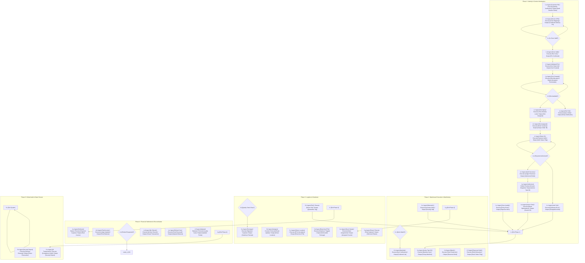

```mermaid
flowchart TD
    subgraph phase_01 [Phase 1: Identity & Context Initialization]
        direction TB
        node_1_001["1.a Ingest [Customer PII] / Execute [Identity Verification] / Output [Auth Session Token]"]
        node_1_002["1.b Ingest [Device GPS] / Execute [Zone Mapping] / Output [Confirmed Delivery Pin]"]
        decision_1_003{"1.c [Is Zone Valid?]"}
        node_1_004["1.d Ingest [Zone Valid] / Execute [Fee Calc] / Output [Pin Confirmed]"]
        node_1_005["1.e Ingest [Zone Invalid] / Execute [Policy Error] / Output [Rejection Alert]"]
        
        node_1_006["1.f Ingest [Validated Pin] / Execute [Cart State Init] / Output [Cart Created]"]
        node_1_007["1.g Ingest [Cart Created] / Execute [Slot Allocation] / Output [Assigned Timestamps]"]
        decision_1_008{"1.h [Slot Available?]"}
        node_1_009["1.i Ingest [Slot Open] / Execute [Time Window Lock] / Output [Slot Assigned]"]
        node_1_010["1.j Ingest [Slot Full] / Execute [Queue Wait] / Output [Retry Notification]"]
        
        node_1_011["1.k Ingest [Slot Assigned] / Execute [Order Creation] / Output [Unique Order ID]"]
        node_1_012["1.l Ingest [Order ID] / Execute [Payment Auth] / Output [Auth Status Flag]"]
        decision_1_013{"1.m [Payment Authorized?]"}
        node_1_014["1.n Ingest [Auth Success] / Execute [Ledger Reserve] / Output [Authorized Order]"]
        node_1_015["1.o Ingest [Auth Fail] / Execute [Gateway Error] / Output [Chargeback Alert]"]
        
        node_1_016["1.p Ingest [Authorized Order] / Execute [Courier Dispatch] / Output [Active Task ID]"]
        node_1_017["1.q Ingest [Active Task] / Execute [Route Optimization] / Output [Courier ID]"]
        
        exit_node_1_018["1.r [Exit Phase 1]"]
    end

    subgraph phase_02 [Phase 2: Warehouse Execution & Manifesting]
        direction TB
        entry_node_2_001["2.a Ingest [Active Task ID] / Execute [Manifest Gen] / Output [Pickup Manifest]"]
        node_2_002["2.b Ingest [Manifest] / Execute [Item Verification] / Output [Collected List]"]
        decision_2_003{"2.c [Items Match?]"}
        node_2_004["2.d Ingest [Match] / Execute [Stock Deduction] / Output [Reserved Hold]"]
        node_2_005["2.e Ingest [Mismatch] / Execute [Inventory Alert] / Output [Packing Halt]"]
        
        node_2_006["2.f Ingest [Reserved Hold] / Execute [Shelf Allocation] / Output [Stock Status Flag]"]
        
        exit_node_2_007["2.g [Exit Phase 2]"]
    end

    subgraph phase_03 [Phase 3: Logistics & Handover]
        direction TB
        entry_node_3_001["3.a Ingest [Stock Status] / Execute [Driver Assignment] / Output [Assigned Courier]"]
        node_3_002["3.b Ingest [Assigned Courier] / Execute [Route Update] / Output [Driver Location]"]
        node_3_003["3.c Ingest [Driver Location] / Execute [ETA Calculation] / Output [Real-time ETA]"]
        
        node_3_004["3.d Ingest [Real-time ETA] / Execute [Handover Trigger] / Output [Deliverable Package]"]
        node_3_005["3.e Ingest [Package] / Execute [Signature Capture] / Output [Handover Receipt]"]
        
        decision_3_006{"3.f [Quality Check Pass?]"}
        node_3_007["3.g Ingest [Pass] / Execute [Final Capture] / Output [Delivered Status]"]
        node_3_008["3.h Ingest [Fail] / Execute [Return Init] / Output [Quarantine Tag]"]
        
        exit_node_3_009["3.i [Exit Phase 3]"]
    end

    subgraph phase_04 [Phase 4: Financial Settlement & Reconciliation]
        direction TB
        entry_node_4_001["4.a Ingest [Delivered Status] / Execute [Payment Capture] / Output [Paid Invoice]"]
        node_4_002["4.b Ingest [Paid Invoice] / Execute [Ledger Update] / Output [Final Balance]"]
        
        decision_4_003{"4.c [Refund Requested?]"}
        node_4_004["4.d Ingest [No Refund] / Execute [Archive Record] / Output [Closed Transaction]"]
        node_4_005["4.e Ingest [Refund Yes] / Execute [Fund Reversal] / Output [Adjusted Balance]"]
        
        node_4_006["4.f Ingest [Adjusted Balance] / Execute [Loyalty Calc] / Output [Updated Points]"]
        
        exit_node_4_007["4.g [Exit Phase 4]"]
    end

    subgraph phase_05 [Phase 5: Global Audit & State Closure]
        direction TB
        entry_node_5_001["5.a Ingest [All Transactions] / Execute [Compliance Audit] / Output [Security Report]"]
        node_5_002["5.b Ingest [Security Report] / Execute [Session Cleanup] / Output [Token Revocation]"]
        
        exit_node_5_003["5.c [Exit System]"]
    end

    %% GLOBAL EXCEPTION INTERCEPT ROUTING (Critical System Faults)
    node_1_005 --> exit_node_1_018
    node_1_015 --> exit_node_1_018
    node_2_005 --> exit_node_1_018
    node_3_008 --> exit_node_1_018

    %% PRIMARY CHRONOLOGICAL FLOW
    node_1_001 --> node_1_002
    node_1_002 --> decision_1_003
    decision_1_003 --> node_1_004
    node_1_004 --> node_1_006
    node_1_006 --> node_1_007
    node_1_007 --> decision_1_008
    decision_1_008 --> node_1_009
    decision_1_008 --> node_1_010
    node_1_009 --> node_1_011
    node_1_011 --> node_1_012
    node_1_012 --> decision_1_013
    decision_1_013 --> node_1_014
    decision_1_013 --> node_1_015
    node_1_014 --> node_1_016
    node_1_016 --> node_1_017
    node_1_017 --> exit_node_1_018

    %% SUB-GROUP INTER-CONNECTS (Hub & Spoke)
    exit_node_1_018 --> entry_node_2_001
    exit_node_2_007 --> entry_node_3_001
    exit_node_3_009 --> entry_node_4_001
    exit_node_4_007 --> entry_node_5_001
    exit_node_5_003 --> exit_node_5_003

    %% LOCAL LOOPBACKS & STATE MUTATION
    decision_1_003 --> node_1_002
    decision_1_008 --> node_1_007
    decision_1_013 --> node_1_012
    decision_2_003 --> node_2_002
    decision_3_006 --> node_3_005
    decision_4_003 --> node_4_001
```

