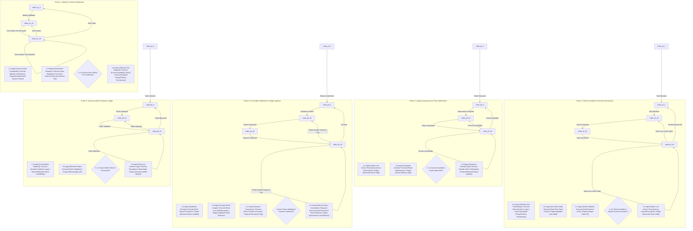

```mermaid
graph TD
    %% ==========================================
    %% PHASE 1: INITIALIZATION & ONBOARDING
    %% ==========================================
    subgraph phase_01 [Phase 1: Identity & Context Initialization]
        direction TB
        
        %% Entrance Hub
        node_p1_e\["1.a Ingest [User Account Credentials] / Execute [Identity Verification] / Output [Authenticated Session Token]\"]
        
        %% System Actors
        node_p1_a1\["1.b Ingest [Geolocation Request] / Execute [Zone Mapping & Fee Calc] / Output [Confirmed Delivery Pin]\"]
        
        %% Decision Logic
        node_p1_d1\{"1.c Is Service Area Valid & Pin Confirmed?"\}
        
        %% Flow
        node_p1_e -- "Identity Validated" --> node_p1_a1
        node_p1_a1 -- "Zone Valid / Fee Accepted" --> node_p1_d1
        
        %% Decision Outcomes
        node_p1_d1 -- "Zone Valid" --> node_p1_e
        node_p1_d1 -- "Zone Invalid / Fee Rejected" --> node_p1_d1
        
        %% Exit Hub
        node_p1_x\["1.d Ingest [Delivery Slot Request] / Execute [Courier Availability Check] / Output [Assigned Pickup/Delivery Timestamps]\"]
    end
    
    %% ==========================================
    %% PHASE 2: ORDER CONSTRUCTION & PAYMENT
    %% ==========================================
    subgraph phase_02 [Phase 2: Order Assembly & Financial Authorization]
        direction TB
        
        %% Entrance Hub
        node_p2_e\["2.a Ingest [Delivery Slot Timestamps] / Execute [Slot Allocation Logic] / Output [Assigned Pickup/Delivery Timestamps]\"]
        
        %% Core Logic
        node_p2_b1\["2.b Ingest [Cart Item Data] / Execute [Real-Time Stock Check] / Output [Updated Cart State]\"]
        node_p2_b2\["2.c Ingest [Order Header] / Execute [Initial Payment Auth] / Output [Unique Order ID]\"]
        
        %% Decision Logic
        node_p2_d1\{"2.d Is Stock Available & Payment Auth Successful?"\}
        
        %% Flow
        node_p2_e -- "Slot Allocated" --> node_p2_b1
        node_p2_b1 -- "Stock Confirmed" --> node_p2_b2
        node_p2_b2 -- "Auth Successful" --> node_p2_d1
        
        %% Decision Outcomes
        node_p2_d1 -- "Stock/Payment OK" --> node_p2_e
        node_p2_d1 -- "Stock Low / Auth Failed" --> node_p2_d1
        
        %% Exit Hub
        node_p2_x\["2.e Ingest [Order Line Items] / Execute [Line-Level Reservation] / Output [Reserved Stock Hold]\"]
    end
    
    %% ==========================================
    %% PHASE 3: LOGISTICS ASSIGNMENT & OPTIMIZATION
    %% ==========================================
    subgraph phase_03 [Phase 3: Logistics Assignment & Fleet Optimization]
        direction TB
        
        %% Entrance Hub
        node_p3_e\["3.a Ingest [Order Line Items] / Execute [Inventory Reservation] / Output [Reserved Stock Hold]\"]
        
        %% Core Logic
        node_p3_b1\["3.b Ingest [Assigned Courier] / Execute [Route Optimization] / Output [Active Delivery Task]\"]
        
        %% Decision Logic
        node_p3_d1\{"3.c Is Courier Available & Route Optimized?"\}
        
        %% Flow
        node_p3_e -- "Reservation Complete" --> node_p3_b1
        node_p3_b1 -- "Route Calculated" --> node_p3_d1
        
        %% Decision Outcomes
        node_p3_d1 -- "Courier Available" --> node_p3_e
        node_p3_d1 -- "Courier Unavailable" --> node_p3_d1
        
        %% Exit Hub
        node_p3_x\["3.d Ingest [Handover Receipt Data] / Execute [Quality Check Verification] / Output [Delivered Status Update]\"]
    end
    
    %% ==========================================
    %% PHASE 4: POST-ORDER PROCESSING & STATE MUTATION
    %% ==========================================
    subgraph phase_04 [Phase 4: Post-Order Settlement & Ledger Updates]
        direction TB
        
        %% Entrance Hub
        node_p4_e\["4.a Ingest [Handover Receipt] / Execute [Final Payment Capture] / Output [Delivered Status Update]\"]
        
        %% Core Logic
        node_p4_b1\["4.b Ingest [Loyalty Points Ledger] / Execute [Point Accrual/Redemption] / Output [Updated Points Balance]\"]
        node_p4_b2\["4.c Ingest [Payment Transaction] / Execute [Fund Transfer & Invoice] / Output [Paid Status Flag]\"]
        
        %% Decision Logic
        node_p4_d1\{"4.d Are Points Validated & Payment Captured?"\}
        
        %% Flow
        node_p4_e -- "Handover Verified" --> node_p4_b1
        node_p4_b1 -- "Points Processed" --> node_p4_b2
        node_p4_b2 -- "Payment Captured" --> node_p4_d1
        
        %% Decision Outcomes
        node_p4_d1 -- "All Clear" --> node_p4_e
        node_p4_d1 -- "Points Invalid / Payment Fail" --> node_p4_d1
        
        %% Exit Hub
        node_p4_x\["4.e Ingest [Refund Claim / Cancellation Request] / Execute [Fund Reversal & Stock Release] / Output [Adjusted Account Balance]\"]
    end
    
    %% ==========================================
    %% PHASE 5: AUDIT & EXCEPTION HANDLING
    %% ==========================================
    subgraph phase_05 [Phase 5: Security Audit & Exception Ledger]
        direction TB
        
        %% Entrance Hub
        node_p5_e\["5.a Ingest [Cancellation Request] / Execute [Inventory Release Logic] / Output [Released Stock Availability]\"]
        
        %% Core Logic
        node_p5_b1\["5.b Ingest [Refund Claim] / Execute [Claim Validation] / Output [Refund Approval]\"]
        
        %% Decision Logic
        node_p5_d1\{"5.c Is Claim Valid & Refund Processed?"\}
        
        %% Flow
        node_p5_e -- "Stock Released" --> node_p5_b1
        node_p5_b1 -- "Claim Validated" --> node_p5_d1
        
        %% Decision Outcomes
        node_p5_d1 -- "Claim Approved" --> node_p5_e
        node_p5_d1 -- "Claim Rejected" --> node_p5_d1
        
        %% Exit Hub
        node_p5_x\["5.d Ingest [Security Incident Logs] / Execute [Compliance Reporting] / Output [Security Incident Report]\"]
    end

    %% ==========================================
    %% INTER-GRAPH FLOW CONNECTIONS (HUB-AND-SPOKE)
    %% ==========================================
    
    %% Phase 1 -> Phase 2
    node_p1_x -- "Slot Allocated" --> node_p2_e
    
    %% Phase 2 -> Phase 3
    node_p2_x -- "Order Reserved" --> node_p3_e
    
    %% Phase 3 -> Phase 4
    node_p3_x -- "Delivery Confirmed" --> node_p4_e
    
    %% Phase 4 -> Phase 5 (Exception/Post-Processing)
    node_p4_x -- "Claim Initiated" --> node_p5_e

    %% ==========================================
    %% GLOBAL EXCEPTION HANDLING LOOPBACKS
    %% (Vertical Loopback to Immediate Preceding Stage)
    %% ==========================================
    
    %% Phase 1 Exception Loopback
    node_p1_d1 -- "Zone Invalid" --> node_p1_a1
    
    %% Phase 2 Exception Loopback
    node_p2_d1 -- "Stock Low / Auth Failed" --> node_p2_b1
    
    %% Phase 3 Exception Loopback
    node_p3_d1 -- "Courier Unavailable" --> node_p3_b1
    
    %% Phase 4 Exception Loopback
    node_p4_d1 -- "Points Invalid / Payment Fail" --> node_p4_b1
    
    %% Phase 5 Exception Loopback
    node_p5_d1 -- "Claim Rejected" --> node_p5_b1
```

