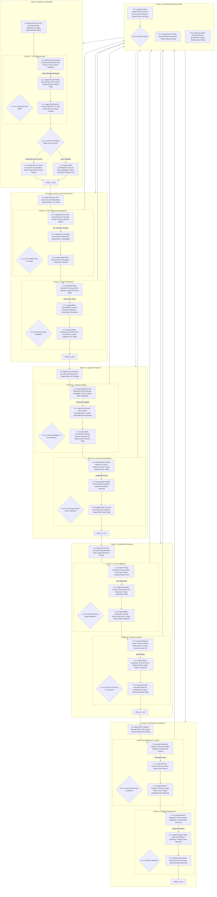

```mermaid
graph TD
    %% ==========================================
    %% PHASE 1: INITIALIZATION & AUTHENTICATION
    %% ==========================================
    subgraph subgraph_phase_01 [Phase 1: Identity & Geolocation]
        direction TB
        %% Entrance Hub
        phase_1_start["1.a Ingest [Customer PII] / Execute [Identity Verification] / Output [Authenticated Token]"]
        
        %% IAM Security Layer
        subgraph subgraph_iam_audit_01 [Phase 1.1: IAM Security Audit]
            direction TB
            iam_entrance["1.1.a Ingest [Login Attempt] / Execute [Credential Hash Check] / Output [Token Validation]"]
            iam_decision{"1.1.b Is Credential Hash Valid?"}
            iam_fail["1.1.c Ingest [Invalid Hash] / Execute [Account Lockout] / Output [Access Denied Flag]"]
            iam_success["1.1.d Ingest [Valid Hash] / Execute [Session TTL Set] / Output [Active Session Context]"]
        end
        
        %% Main Flow
        phase_1_start --> iam_entrance
        iam_entrance -- "Hash Mismatch Detected" --> iam_fail
        iam_fail --> iam_success
        
        iam_success --> geo_decision{"1.a.1 Is GPS Coordinates Within Service Zone?"}
        geo_fail["1.a.2 Ingest [Out of Zone] / Execute [Fee Calculation Null] / Output [Service Area Reject]"]
        geo_pass["1.a.3 Ingest [Valid Coordinates] / Execute [Zone Mapping] / Output [Confirmed Delivery Pin]"]
        
        geo_decision -- "Coordinates Out of Zone" --> geo_fail
        geo_fail --> phase_1_end
        geo_decision -- "Zone Validated" --> geo_pass
        geo_pass --> phase_1_end
    end

    subgraph subgraph_phase_02 [Phase 2: Inventory & Cart Construction]
        direction TB
        %% Entrance Hub
        phase_2_start["2.a Ingest [Delivery Pin] / Execute [Cart Initialization] / Output [Empty Cart State]"]
        
        %% Store Associate Layer
        subgraph subgraph_store_stock_02 [Phase 2.1: Store Inventory Management]
            direction TB
            store_entrance["2.1.a Ingest [Delivery Pin] / Execute [Zone Coverage Check] / Output [Valid Pin Status]"]
            store_decision{"2.1.b Is Pin Within Store Coverage?"}
            store_fail["2.1.c Ingest [No Coverage] / Execute [Pin Rejection] / Output [Store Unavailable]"]
            store_success["2.1.d Ingest [Valid Pin] / Execute [Zone Activation] / Output [Pin Verified]"]
        end
        
        %% Cart Logic
        subgraph subgraph_cart_logic_02 [Phase 2.2: Cart Construction]
            direction TB
            cart_entrance["2.2.a Ingest [Product Selection] / Execute [SKU Lookup] / Output [Cart Item Draft]"]
            cart_decision{"2.2.b Is Real-time Stock Available?"}
            cart_fail["2.2.c Ingest [Stock Unavailable] / Execute [Inventory Release] / Output [Item Removed]"]
            cart_success["2.2.d Ingest [Stock Confirmed] / Execute [Price Calculation] / Output [Updated Cart State]"]
        end
        
        %% Flows
        phase_2_start --> store_entrance
        store_entrance -- "Pin Outside Coverage" --> store_fail
        store_fail --> store_success
        store_success --> cart_entrance
        cart_entrance -- "SKU Out of Stock" --> cart_fail
        cart_fail --> cart_success
        cart_success --> phase_2_end
    end

    subgraph subgraph_phase_03 [Phase 3: Logistics & Payment]
        direction TB
        %% Entrance Hub
        phase_3_start["3.a Ingest [Cart Contents] / Execute [Slot Allocation] / Output [Order ID Pending]"]
        
        %% Logistics Dispatcher Layer
        subgraph subgraph_logistics_03 [Phase 3.1: Logistics Slotting]
            direction TB
            log_entrance["3.1.a Ingest [Delivery Slot Request] / Execute [Driver Availability Check] / Output [Slot Availability]"]
            log_decision{"3.1.b Is Driver Available for Time Window?"}
            log_fail["3.1.c Ingest [No Driver] / Execute [Slot Reassignment] / Output [Slot Adjustment Request]"]
            log_success["3.1.d Ingest [Slot Confirmed] / Execute [Courier Assignment] / Output [Active Delivery Task]"]
        end
        
        %% Payment Layer
        subgraph subgraph_payment_03 [Phase 3.2: Payment Authorization]
            direction TB
            pay_entrance["3.2.a Ingest [Order Total & Method] / Execute [Gateway Auth] / Output [Payment Auth Code]"]
            pay_decision{"3.2.b Is Auth Code Valid & Funds Sufficient?"}
            pay_fail["3.2.c Ingest [Auth Failed] / Execute [Hold Release] / Output [Transaction Declined]"]
            pay_success["3.2.d Ingest [Auth Success] / Execute [Fund Capture] / Output [Paid Status Flag]"]
        end
        
        %% Flows
        phase_3_start --> log_entrance
        log_entrance -- "No Driver Available" --> log_fail
        log_fail --> log_success
        log_success --> pay_entrance
        pay_entrance -- "Insufficient Funds" --> pay_fail
        pay_fail --> pay_success
        pay_success --> phase_3_end
    end

    subgraph subgraph_phase_04 [Phase 4: Fulfillment & Handover]
        direction TB
        %% Entrance Hub
        phase_4_start["4.a Ingest [Order ID] / Execute [Pickup Manifest Gen] / Output [Ready-for-Pickup]"]
        
        %% Store Associate Layer (Fulfillment)
        subgraph subgraph_store_fulfill_04 [Phase 4.1: Store Fulfillment]
            direction TB
            store_ful_entrance["4.1.a Ingest [Pickup Manifest] / Execute [Item Scanning] / Output [Collected Items List]"]
            store_ful_decision{"4.1.b Do Scanned Items Match Manifest?"}
            store_ful_fail["4.1.c Ingest [Mismatch Found] / Execute [Re-pick Request] / Output [Verification Hold]"]
            store_ful_success["4.1.d Ingest [Match Confirmed] / Execute [Stock Deduction] / Output [Stock Status Updated]"]
        end
        
        %% Courier & Handover
        subgraph subgraph_courier_04 [Phase 4.2: Courier Execution]
            direction TB
            cour_entrance["4.2.a Ingest [Collected Items] / Execute [Route Optimization] / Output [Active Courier ID]"]
            cour_decision{"4.2.b Is Courier En Route to Customer?"}
            cour_fail["4.2.c Ingest [Delay Detected] / Execute [Time Window Alert] / Output [Status: Delayed]"]
            cour_success["4.2.d Ingest [Arrived] / Execute [Handover Verification] / Output [Delivered Status Flag]"]
        end
        
        %% Flows
        phase_4_start --> store_ful_entrance
        store_ful_entrance -- "Items Mismatch" --> store_ful_fail
        store_ful_fail --> store_ful_success
        store_ful_success --> cour_entrance
        cour_entrance -- "Route Delay" --> cour_fail
        cour_fail --> cour_success
        cour_success --> phase_4_end
    end

    subgraph subgraph_phase_05 [Phase 5: Post-Order & Settlement]
        direction TB
        %% Entrance Hub
        phase_5_start["5.a Ingest [Order Status] / Execute [Post-Order Logic] / Output [Settlement Queue]"]
        
        %% Finance Layer
        subgraph subgraph_finance_05 [Phase 5.1: Settlement & Loyalty]
            direction TB
            fin_entrance["5.1.a Ingest [Payment Capture] / Execute [Ledger Update] / Output [Final Invoice]"]
            fin_decision{"5.1.b Is Invoice Generation Complete?"}
            fin_fail["5.1.c Ingest [Error] / Execute [Invoice Retry] / Output [Hold Status]"]
            fin_success["5.1.d Ingest [Invoice Ready] / Execute [Loyalty Points Calc] / Output [Updated Points Balance]"]
        end
        
        %% Refund Layer
        subgraph subgraph_refund_05 [Phase 5.2: Claims Management]
            direction TB
            ref_entrance["5.2.a Ingest [Refund Request] / Execute [Claim Validation] / Output [Claim Decision]"]
            ref_decision{"5.2.b Is Claim Validated?"}
            ref_fail["5.2.c Ingest [Invalid Claim] / Execute [Request Evidence] / Output [Claim Rejected]"]
            ref_success["5.2.d Ingest [Valid Claim] / Execute [Fund Reversal] / Output [Refund Approval]"]
        end
        
        %% Flows
        phase_5_start --> fin_entrance
        fin_entrance -- "Generation Error" --> fin_fail
        fin_fail --> fin_success
        fin_success --> ref_entrance
        ref_entrance -- "Evidence Missing" --> ref_fail
        ref_fail --> ref_success
        ref_success --> phase_5_end
    end

    %% ==========================================
    %% GLOBAL EXCEPTION LEDGER (ANTI-LEAK)
    %% ==========================================
    subgraph subgraph_global_audit_05 [Phase 5.5: Global Infrastructure Audit]
        direction TB
        audit_entrance["5.5.a Ingest [Critical System Fault] / Execute [Root Cause Analysis] / Output [Audit Log Entry]"]
        audit_entrance --> audit_decision{"5.5.b Is Fault Critical?"}
        audit_fail["5.5.c Ingest [Non-Critical] / Execute [Alert Generation] / Output [Warning Log]"]
        audit_success["5.5.d Ingest [Critical] / Execute [System Quarantine] / Output [Maintenance Mode]"]
    end

    %% ==========================================
    %% INTER-SUBGRAPH CONNECTIONS (HUB-AND-SPOKE)
    %% ==========================================
    
    %% Exit Phase 1 to Phase 2
    phase_1_end --> phase_2_start

    %% Exit Phase 2 to Phase 3
    phase_2_end --> phase_3_start

    %% Exit Phase 3 to Phase 4
    phase_3_end --> phase_4_start

    %% Exit Phase 4 to Phase 5
    phase_4_end --> phase_5_start

    %% Exception Routing: Critical System Faults to Global Audit
    subgraph_store_stock_02 --> subgraph_global_audit_05
    subgraph_cart_logic_02 --> subgraph_global_audit_05
    subgraph_logistics_03 --> subgraph_global_audit_05
    subgraph_payment_03 --> subgraph_global_audit_05
    subgraph_store_fulfill_04 --> subgraph_global_audit_05
    subgraph_courier_04 --> subgraph_global_audit_05
    subgraph_finance_05 --> subgraph_global_audit_05

    %% Exception Routing: Functional Exceptions to Previous Subgraph Exit
    subgraph_global_audit_05 --> subgraph_phase_01
    subgraph_global_audit_05 --> subgraph_phase_02
    subgraph_global_audit_05 --> subgraph_phase_03
    subgraph_global_audit_05 --> subgraph_phase_04
    subgraph_global_audit_05 --> subgraph_phase_05

    %% ==========================================
    %% CLEAN UP UNNECESSARY LINKS FOR FLAT LAYOUT
    %% ==========================================
    phase_1_end
    phase_2_end
    phase_3_end
    phase_4_end
    phase_5_end
    subgraph_global_audit_05

```

