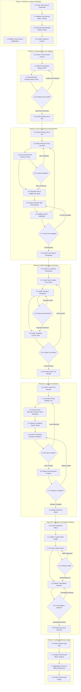

```mermaid
graph TD
    %% ==========================================
    %% SUBGRAPH PHASE 01: IDENTITY & LOCATION
    %% ==========================================
    subgraph phase_01 [Phase 01: Identity & Location Verification]
        direction TB
        %% Entrance Hub
        hub_01_in["1.a Initiates 'User Account' Registration"]
        
        %% Discovery & Curation Layer
        step_01_01["1.1 Verify 'User Account' Credentials"]
        step_01_02["1.2 Validate 'IAM Security Officer' Policies"]
        step_01_03["1.3 Generate Authenticated Session Token"]
        
        %% Exit Hub
        hub_01_out["1.b Confirm Identity & Context"]
        
        %% Logic
        step_01_01 --> step_01_02
        step_01_02 --> step_01_03
        step_01_03 --> hub_01_out
    end

    %% ==========================================
    %% SUBGRAPH PHASE 02: GEOLOCATION & ZONE MAPPING
    %% ==========================================
    subgraph phase_02 [Phase 02: Geolocation & Zone Mapping]
        direction TB
        %% Entrance Hub
        hub_02_in["2.a Confirm 'User Account' Context"]
        
        %% Discovery & Curation Layer
        step_02_01["2.1 Submit 'Geolocation Request' GPS"]
        step_02_02["2.2 Map 'Merchant Inventory Stock' Zones"]
        
        %% Decision Crossroads
        decision_02_01{"2.3 Is Delivery Zone Valid?"}
        
        %% Exit Hub
        hub_02_out["2.b Confirm Delivery Pin & Fee"]
        
        %% Logic
        hub_02_in --> step_02_01
        step_02_01 --> step_02_02
        step_02_02 --> decision_02_01
        
        %% Decision Path - Success
        decision_02_01 -- "Valid Zone Confirmed" --> hub_02_out
        
        %% Decision Path - Failure (Loopback)
        decision_02_01 -- "Invalid Zone Detected" --> step_02_01
    end

    %% ==========================================
    %% SUBGRAPH PHASE 03: CART CONSTRUCTION & SLOT ALLOCATION
    %% ==========================================
    subgraph phase_03 [Phase 03: Cart Construction & Slot Allocation]
        direction TB
        %% Entrance Hub
        hub_03_in["3.a Confirm Delivery Pin & Fee"]
        
        %% Discovery & Curation Layer
        step_03_01["3.1 Select Product to Form 'Cart Item'"]
        step_03_02["3.2 Execute Real-Time Inventory Check"]
        step_03_03["3.3 Calculate Price & Update Cart State"]
        
        step_03_04["3.4 Request 'Delivery Slot' Time Window"]
        step_03_05["3.5 Validate Courier Availability"]
        
        %% Decision Crossroads
        decision_03_01{"3.6 Is Stock Available?"}
        decision_03_02{"3.7 Is Slot Time Available?"}
        
        %% Exit Hub
        hub_03_out["3.b Confirm Cart State & Timestamps"]
        
        %% Logic
        hub_03_in --> step_03_01
        step_03_01 --> step_03_02
        step_03_02 --> step_03_03
        step_03_03 --> step_03_04
        step_03_04 --> step_03_05
        step_03_05 --> step_03_01
        
        %% Decision 3.6 Path
        step_03_02 --> decision_03_01
        decision_03_01 -- "Stock Confirmed" --> step_03_03
        decision_03_01 -- "Stock Depleted" --> step_03_01
        
        %% Decision 3.7 Path
        step_03_05 --> decision_03_02
        decision_03_02 -- "Slot Allocated" --> hub_03_out
        decision_03_02 -- "No Slots Available" --> step_03_04
    end

    %% ==========================================
    %% SUBGRAPH PHASE 04: ORDER FINALIZATION & PAYMENT
    %% ==========================================
    subgraph phase_04 [Phase 04: Order Finalization & Payment]
        direction TB
        %% Entrance Hub
        hub_04_in["4.a Confirm Cart State & Timestamps"]
        
        %% Discovery & Curation Layer
        step_04_01["4.1 Create 'Order Header' & Line Items"]
        step_04_02["4.2 Initiate 'Payment Transaction'"]
        step_04_03["4.3 Assign 'Assigned Courier' Task"]
        
        %% Decision Crossroads
        decision_04_01{"4.4 Is Payment Authorized?"}
        decision_04_02{"4.5 Is Order Lock Active?"}
        
        %% Exit Hub
        hub_04_out["4.b Generate Order ID & Receipt"]
        
        %% Logic
        hub_04_in --> step_04_01
        step_04_01 --> step_04_02
        step_04_02 --> step_04_03
        
        %% Decision 4.4 Path
        step_04_02 --> decision_04_01
        decision_04_01 -- "Payment Authorized" --> step_04_03
        decision_04_01 -- "Payment Failed" --> step_04_02
        
        %% Decision 4.5 Path
        step_04_03 --> decision_04_02
        decision_04_02 -- "Lock Not Active" --> hub_04_out
        decision_04_02 -- "Order Locked" --> step_04_01
    end

    %% ==========================================
    %% SUBGRAPH PHASE 05: LOGISTICS & HANDOVER
    %% ==========================================
    subgraph phase_05 [Phase 05: Logistics & Handover]
        direction TB
        %% Entrance Hub
        hub_05_in["5.a Confirm Order ID & Receipt"]
        
        %% Discovery & Curation Layer
        step_05_01["5.1 Generate 'Pickup Manifest' List"]
        step_05_02["5.2 Execute Store 'Merchant Inventory Stock' Deduction"]
        step_05_03["5.3 Optimize 'Assigned Courier' Route"]
        step_05_04["5.4 Perform 'Handover Receipt' Verification"]
        step_05_05["5.5 Capture Final Payment & Status"]
        
        %% Decision Crossroads
        decision_05_01{"5.6 Are Items Verified?"}
        decision_05_02{"5.7 Is Delivery Complete?"}
        
        %% Exit Hub
        hub_05_out["5.b Update Delivered Status"]
        
        %% Logic
        hub_05_in --> step_05_01
        step_05_01 --> step_05_02
        step_05_02 --> step_05_03
        step_05_03 --> step_05_04
        
        %% Decision 5.6 Path
        step_05_04 --> decision_05_01
        decision_05_01 -- "Items Verified" --> step_05_05
        decision_05_01 -- "Items Mismatch" --> step_05_01
        
        %% Decision 5.7 Path
        step_05_05 --> decision_05_02
        decision_05_02 -- "Delivery Complete" --> hub_05_out
        decision_05_02 -- "Delivery Failed" --> step_05_04
    end

    %% ==========================================
    %% SUBGRAPH PHASE 06: POST-ORDER & EXCEPTIONS
    %% ==========================================
    subgraph phase_06 [Phase 06: Post-Order & Exception Handling]
        direction TB
        %% Entrance Hub
        hub_06_in["6.a Confirm Delivered Status"]
        
        %% Discovery & Curation Layer
        step_06_01["6.1 Update 'Loyalty Points Ledger'"]
        step_06_02["6.2 Process 'Refund Claim'"]
        step_06_03["6.3 Handle 'Cancellation Request'"]
        
        %% Decision Crossroads
        decision_06_01{"6.4 Is Refund Valid?"}
        decision_06_02{"6.5 Is Cancellation Allowed?"}
        
        %% Exit Hub
        hub_06_out["6.b Finalize Account & Inventory"]
        
        %% Logic
        hub_06_in --> step_06_01
        step_06_01 --> step_06_02
        step_06_02 --> step_06_03
        
        %% Decision 6.4 Path
        step_06_02 --> decision_06_01
        decision_06_01 -- "Refund Approved" --> step_06_03
        decision_06_01 -- "Refund Rejected" --> step_06_02
        
        %% Decision 6.5 Path
        step_06_03 --> decision_06_02
        decision_06_02 -- "Cancellation Allowed" --> hub_06_out
        decision_06_02 -- "Cancellation Blocked" --> step_06_03
    end

    %% ==========================================
    %% SUBGRAPH PHASE 07: AUDIT & SETTLEMENT
    %% ==========================================
    subgraph phase_07 [Phase 07: Audit & Settlement Ledger]
        direction TB
        %% Entrance Hub
        hub_07_in["7.a Collect System Audit Logs"]
        
        %% Discovery & Curation Layer
        step_07_01["7.1 Compile 'IAM Security Officer' Reports"]
        step_07_02["7.2 Aggregate 'Finance & Billing' Settlements"]
        
        %% Exit Hub
        hub_07_out["7.b Finalize Global Audit Ledger"]
        
        %% Logic
        hub_07_in --> step_07_01
        step_07_01 --> step_07_02
        step_07_02 --> hub_07_out
    end

    %% INTER-SUBGRAPH CONNECTIONS (HUB-AND-SPOKE)
    hub_01_out --> hub_02_in
    hub_02_out --> hub_03_in
    hub_03_out --> hub_04_in
    hub_04_out --> hub_05_in
    hub_05_out --> hub_06_in
    hub_06_out --> hub_07_in
```

