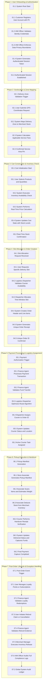

```mermaid
graph TD
    %% ==========================================
    %% PHASE 01: USER ONBOARDING & AUTHENTICATION
    %% ==========================================
    subgraph phase_01 [Phase 1: User Onboarding & Authentication]
        direction TB

        %% Hub Nodes
        hub_01_entry["01.1 System Root Start"]
        hub_01_exit["01.2 Authenticated Session Established"]

        %% Process Nodes
        step_01_1["01.1 Customer Registers User Account with PII"]
        step_01_2["01.2 IAM Officer Validates Identity Credentials"]
        step_01_3["01.3 IAM Officer Enforces Data Privacy Boundaries"]
        step_01_4["01.4 System Generates Authenticated Session Token"]
    end

    %% ==========================================
    %% PHASE 02: GEOLOCATION & ZONE VALIDATION
    %% ==========================================
    subgraph phase_02 [Phase 2: Geolocation & Zone Mapping]
        direction TB

        %% Hub Nodes
        hub_02_entry["02.1 Delivery Zone Validation Trigger"]
        hub_02_exit["02.2 Confirmed Service Area Pin"]

        %% Process Nodes
        step_02_1["02.1 User Submits GPS Coordinates Request"]
        step_02_2["02.2 System Maps Delivery Zone to Merchant Stock"]
        step_02_3["02.3 System Calculates Applicable Service Fees"]
    end

    %% ==========================================
    %% PHASE 03: CART CONSTRUCTION & INVENTORY
    %% ==========================================
    subgraph phase_03 [Phase 3: Cart Construction & Inventory Check]
        direction TB

        %% Hub Nodes
        hub_03_entry["03.1 Cart Initialization Start"]
        hub_03_exit["03.2 Real-Time Stock Confirmation"]

        %% Process Nodes
        step_03_1["03.1 User Selects Products and Quantities"]
        step_03_2["03.2 System Executes Inventory Availability Check"]
        step_03_3["03.3 System Performs Real-Time Price Calculation"]
        step_03_4["03.4 System Updates Cart State with Stock Levels"]
    end

    %% ==========================================
    %% PHASE 04: SLOTS & ORDER CREATION
    %% ==========================================
    subgraph phase_04 [Phase 4: Slot Allocation & Order Creation]
        direction TB

        %% Hub Nodes
        hub_04_entry["04.1 Slot Allocation Request Received"]
        hub_04_exit["04.5 Unique Order ID Confirmed"]

        %% Process Nodes
        step_04_1["04.1 User Requests Specific Delivery Slot"]
        step_04_2["04.2 Logistics Dispatcher Validates Courier Availability"]
        step_04_3["04.3 Dispatcher Allocates Time-Window Slot"]
        step_04_4["04.4 System Creates Order Header and Line Items"]
        step_04_5["04.5 System Generates Unique Order Receipt"]
    end

    %% ==========================================
    %% PHASE 05: PAYMENT & LOGISTICS ASSIGNMENT
    %% ==========================================
    subgraph phase_05 [Phase 5: Payment Processing & Logistics Assignment]
        direction TB

        %% Hub Nodes
        hub_05_entry["05.1 Payment Authorization Trigger"]
        hub_05_exit["05.2 Active Courier Task Assigned"]

        %% Process Nodes
        step_05_1["05.1 Finance Agent Processes Payment Transaction"]
        step_05_2["05.2 Finance Agent Validates Fund Transfer"]
        step_05_3["05.3 Logistics Dispatcher Optimizes Route Algorithm"]
        step_05_4["05.4 Dispatcher Assigns Courier to Order ID"]
        step_05_5["05.5 System Updates Courier Status and Location"]
    end

    %% ==========================================
    %% PHASE 06: PICKUP & HANDOVER EXECUTION
    %% ==========================================
    subgraph phase_06 [Phase 6: Pickup Execution & Handover]
        direction TB

        %% Hub Nodes
        hub_06_entry["06.1 Pickup Manifest Generation"]
        hub_06_exit["06.2 Final Payment Capture Completed"]

        %% Process Nodes
        step_06_1["06.1 Store Associate Generates Pickup Manifest"]
        step_06_2["06.2 Associate Scans Items and Estimates Weight"]
        step_06_3["06.3 Associate Deducts Stock from Merchant Inventory"]
        step_06_4["06.4 Courier Performs Handover Receipt Verification"]
        step_06_5["06.5 System Updates Delivered Status and Captures Funds"]
    end

    %% ==========================================
    %% PHASE 07: POST-ORDER LIFECYCLE & EXCEPTIONS
    %% ==========================================
    subgraph phase_07 [Phase 7: Post-Order Lifecycle & Exception Handling]
        direction TB

        %% Hub Nodes
        hub_07_entry["07.1 Post-Order Event Trigger"]
        hub_07_exit["07.2 Global System Audit Ledger"]

        %% Process Nodes
        step_07_1["07.1 User Manages Loyalty Points or Subscriptions"]
        step_07_2["07.2 Finance Agent Validates Loyalty Redemptions"]
        step_07_3["07.3 User Initiates Refund Claim or Cancellation"]
        step_07_4["07.4 Finance Agent Validates Refund Evidence"]
        step_07_5["07.5 Merchant Manager Executes Inventory Release"]
        step_07_6["07.6 IAM Officer Audits Full Compliance Logs"]
    end

    %% ==========================================
    %% GLOBAL LINKING & FLOW LOGIC
    %% ==========================================

    %% Phase 1 Flow
    hub_01_entry --> step_01_1
    step_01_1 --> step_01_2
    step_01_2 --> step_01_3
    step_01_3 --> step_01_4
    step_01_4 --> hub_01_exit

    %% Phase 1 to 2 Link
    hub_01_exit --> hub_02_entry

    %% Phase 2 Flow
    hub_02_entry --> step_02_1
    step_02_1 --> step_02_2
    step_02_2 --> step_02_3
    step_02_3 --> hub_02_exit

    %% Phase 2 to 3 Link
    hub_02_exit --> hub_03_entry

    %% Phase 3 Flow
    hub_03_entry --> step_03_1
    step_03_1 --> step_03_2
    step_03_2 --> step_03_3
    step_03_3 --> step_03_4
    step_03_4 --> hub_03_exit

    %% Phase 3 to 4 Link
    hub_03_exit --> hub_04_entry

    %% Phase 4 Flow
    hub_04_entry --> step_04_1
    step_04_1 --> step_04_2
    step_04_2 --> step_04_3
    step_04_3 --> step_04_4
    step_04_4 --> step_04_5
    step_04_5 --> hub_04_exit

    %% Phase 4 to 5 Link
    hub_04_exit --> hub_05_entry

    %% Phase 5 Flow
    hub_05_entry --> step_05_1
    step_05_1 --> step_05_2
    step_05_2 --> step_05_3
    step_05_3 --> step_05_4
    step_05_4 --> step_05_5
    step_05_5 --> hub_05_exit

    %% Phase 5 to 6 Link
    hub_05_exit --> hub_06_entry

    %% Phase 6 Flow
    hub_06_entry --> step_06_1
    step_06_1 --> step_06_2
    step_06_2 --> step_06_3
    step_06_3 --> step_06_4
    step_06_4 --> step_06_5
    step_06_5 --> hub_06_exit

    %% Phase 6 to 7 Link
    hub_06_exit --> hub_07_entry

    %% Phase 7 Flow
    hub_07_entry --> step_07_1
    step_07_1 --> step_07_2
    step_07_2 --> step_07_3
    step_07_3 --> step_07_4
    step_07_4 --> step_07_5
    step_07_5 --> step_07_6
    step_07_6 --> hub_07_exit
```

