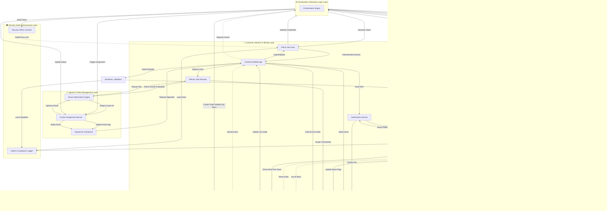

```mermaid
graph TD
    subgraph Domain_Orchestration["🌐 Orchestrator & Business Logic Layer"]
        direction TB
        Orchestration[Orchestration Engine]
    end

    subgraph Domain_Customer_Facing["🛒 Customer Interface & Identity Layer"]
        direction TB
        User_Auth[IAM & User Auth]
        Geo_Location[Geolocation Service]
        Cart_Mgmt[Cart & Pricing Logic]
        Slot_Mgmt[Delivery Slot Allocator]
        Customer_Ports[Customer API Endpoints]
        Customer_Visual[Customer Mobile App]
    end

    subgraph Domain_Legacy_Queue["📦 Store Operations & Inventory Layer"]
        direction TB
        Inventory_Dal[Local Inventory DB]
        Pickup_Mgmt[Pickup Manifest Service]
        Store_Assoc[Store Associate Interface]
        Stock_Logic[Stock Reservation & Deduction]
        Store_Ports[Store Ops API Endpoints]
    end

    subgraph Domain_Logistics_Fleet["🚚 Logistics & Fleet Management Layer"]
        direction TB
        Courier_Assign[Courier Assignment Service]
        Route_Optim[Route Optimization Engine]
        Dispatcher_Visual[Dispatcher Dashboard]
    end

    subgraph Domain_Finance_Ledger["💳 Finance, Billing & Settlement Layer"]
        direction TB
        Payment_GW[Payment Gateway Adapter]
        Billing_Cycle[Subscription & Billing Cycle]
        Refund_Claims[Refund Claim Engine]
        Loyalty_Ledger[Loyalty Points Ledger]
        Finance_Ports[Finance & Billing API]
    end

    subgraph Domain_Audit_Security["🛡️ Security, Audit & Governance Layer"]
        direction TB
        Audit_Log[Audit & Compliance Logger]
        Security_Officer[Security Officer Console]
    end

    %% --- PHASE 1: INITIALIZATION & ONBOARDING ---
    
    %% 1. User Account & Auth Flow
    Customer_Visual -->|Login/Register| User_Auth
    User_Auth -->|Validate Credentials| Domain_Orchestration
    Domain_Orchestration -->|Verify Policy| Security_Officer
    Domain_Orchestration -->|Generate Token| User_Auth
    User_Auth -->|Authenticated Session| Customer_Visual
    User_Auth -->|Log Access| Audit_Log

    %% --- PHASE 2: ORDER CREATION & PREPARATION ---

    %% 2. Geolocation
    Customer_Visual -->|Send GPS| Geo_Location
    Geo_Location -->|Validate Zone| Inventory_Dal
    Inventory_Dal -->|Return Fee/Pin| Geo_Location
    Geo_Location -->|Confirm Pin| Cart_Mgmt

    %% 3. Cart & Slot Management
    Customer_Visual -->|Select Items| Cart_Mgmt
    Cart_Mgmt -->|Check Real-Time Stock| Inventory_Dal
    Inventory_Dal -->|Update Stock Flags| Cart_Mgmt
    Cart_Mgmt -->|Update Cart State| Customer_Visual

    Customer_Visual -->|Request Time| Slot_Mgmt
    Slot_Mgmt -->|Check Courier Availability| Route_Optim
    Route_Optim -->|Allocate Slot| Slot_Mgmt
    Slot_Mgmt -->|Assign Timestamps| Cart_Mgmt

    %% 4. Order Finalization
    Customer_Visual -->|Submit Final Order| Cart_Mgmt
    Cart_Mgmt -->|Create Order Header/Line Items| Domain_Orchestration
    Domain_Orchestration -->|Reserve Stock| Stock_Logic
    Stock_Logic -->|Update Inventory DB| Inventory_Dal

    %% --- PHASE 3: PAYMENT & FULFILLMENT TRIGGER ---

    %% 5. Payment Transaction
    Domain_Orchestration -->|Authorize Funds| Payment_GW
    Payment_GW -->|Capture/Return Receipt| Billing_Cycle
    Billing_Cycle -->|Generate Invoice| Finance_Ports
    Billing_Cycle -->|Lock Order| Domain_Orchestration
    Billing_Cycle -->|Update Loyalty| Loyalty_Ledger
    Loyalty_Ledger -->|Apply Discount| Cart_Mgmt
    Billing_Cycle -->|Log Transaction| Audit_Log

    %% --- PHASE 4: LOGISTICS & STORE EXECUTION ---

    %% 6. Courier Assignment
    Domain_Orchestration -->|Trigger Assignment| Courier_Assign
    Courier_Assign -->|Optimize Route| Route_Optim
    Route_Optim -->|Assign Courier ID| Courier_Assign
    Courier_Assign -->|Update Driver App| Dispatcher_Visual

    %% 7. Store Associate Workflow
    Domain_Orchestration -->|Generate Manifest| Pickup_Mgmt
    Pickup_Mgmt -->|Assign Manifest| Store_Assoc
    Store_Assoc -->|Scan Items| Inventory_Dal
    Inventory_Dal -->|Update Shelf Allocation| Stock_Logic
    Store_Assoc -->|Confirm Ready| Domain_Orchestration

    %% --- PHASE 5: HANDOVER & POST-ORDER ---

    %% 8. Handover Receipt
    Domain_Orchestration -->|Update Status| Courier_Assign
    Courier_Assign -->|Notify Driver| Dispatcher_Visual
    Dispatcher_Visual -->|Request Signature| Customer_Visual
    Customer_Visual -->|Submit Receipt| Handover_Validation
    Handover_Validation -->|Verify Count| Store_Assoc
    Store_Assoc -->|Finalize Delivery| Payment_GW
    Payment_GW -->|Mark Paid| Billing_Cycle
    Handover_Validation -->|Log Completion| Audit_Log

    %% --- ERROR HANDLING & EXCEPTION FLOWS ---

    %% Exception: Stock Failure
    Stock_Logic -.->|Out of Stock| Cart_Mgmt
    Cart_Mgmt -.->|Remove Item| Customer_Visual

    %% Exception: Payment Failure
    Payment_GW -.->|Decline| Billing_Cycle
    Billing_Cycle -.->|Initiate Refund| Refund_Claims
    Refund_Claims -.->|Adjust Balance| Loyalty_Ledger

    %% Exception: Cancellation Request
    Customer_Visual -.->|Request Cancel| Domain_Orchestration
    Domain_Orchestration -.->|Check Lock| Billing_Cycle
    Billing_Cycle -.->|Unlock/Revert| Stock_Logic
    Stock_Logic -.->|Release Inventory| Inventory_Dal
    Stock_Logic -.->|Reset Order| Cart_Mgmt

    %% External Actor Loops
    Security_Officer -.->|Audit/Force Lock| User_Auth
    Store_Assoc -.->|Manual Adjustment| Inventory_Dal
    Finance_Ports -.->|Validate Refund| Refund_Claims
    Finance_Ports -.->|Setup Subscription| Billing_Cycle
```