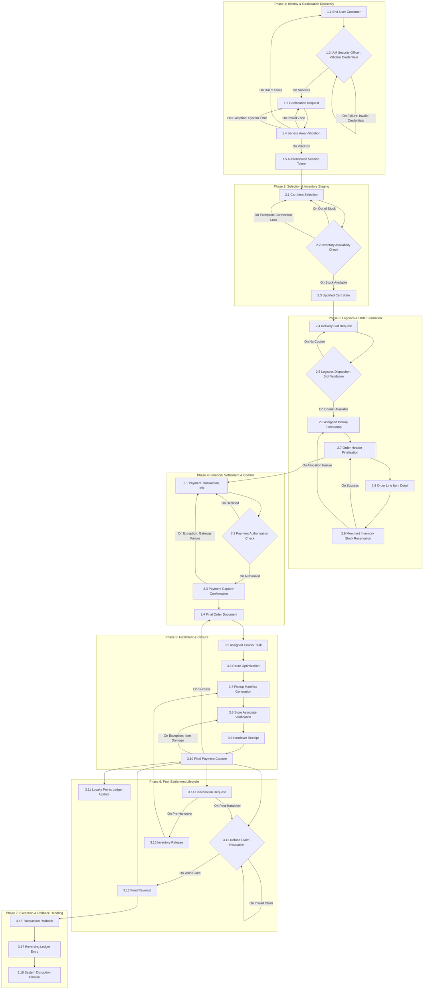

```mermaid
graph TD
    subgraph phase_01 [Phase 1: Identity & Geolocation Discovery]
        user_entry["1.1 End-User Customer"]
        iam_check{"1.2 IAM Security Officer: Validate Credentials"}
        geo_request["1.3 Geolocation Request"]
        geo_valid["1.4 Service Area Validation"]
        user_ctx["1.5 Authenticated Session Token"]
        
        user_entry --> iam_check
        iam_check -- "On Success" --> geo_request
        iam_check -- "On Failure: Invalid Credentials" --> iam_check
        geo_request --> geo_valid
        geo_valid -- "On Valid Pin" --> user_ctx
        geo_valid -- "On Invalid Zone" --> geo_request
        geo_valid -- "On Out of Stock" --> user_entry
        geo_valid -- "On Exception: System Error" --> geo_request
    end

    subgraph phase_02 [Phase 2: Selection & Inventory Staging]
        user_ctx
        cart_create["2.1 Cart Item Selection"]
        inv_check{"2.2 Inventory Availability Check"}
        cart_update["2.3 Updated Cart State"]
        
        user_ctx --> cart_create
        cart_create --> inv_check
        inv_check -- "On Stock Available" --> cart_update
        inv_check -- "On Out of Stock" --> cart_create
        inv_check -- "On Exception: Connection Loss" --> cart_create
    end

    subgraph phase_03 [Phase 3: Logistics & Order Formation]
        cart_update
        slot_request["2.4 Delivery Slot Request"]
        dispatcher_check{"2.5 Logistics Dispatcher: Slot Validation"}
        slot_assign["2.6 Assigned Pickup Timestamp"]
        order_hdr["2.7 Order Header Finalization"]
        line_item["2.8 Order Line Item Detail"]
        stock_reserve["2.9 Merchant Inventory Stock Reservation"]
        
        cart_update --> slot_request
        slot_request --> dispatcher_check
        dispatcher_check -- "On Courier Available" --> slot_assign
        dispatcher_check -- "On No Courier" --> slot_request
        slot_assign --> order_hdr
        order_hdr --> line_item
        line_item --> stock_reserve
        stock_reserve -- "On Success" --> order_hdr
        stock_reserve -- "On Allocation Failure" --> slot_assign
    end

    subgraph phase_04 [Phase 4: Financial Settlement & Commit]
        order_hdr
        payment_init["3.1 Payment Transaction Init"]
        auth_check{"3.2 Payment Authorization Check"}
        capture_confirm["3.3 Payment Capture Confirmation"]
        order_commit["3.4 Final Order Document"]
        
        order_hdr --> payment_init
        payment_init --> auth_check
        auth_check -- "On Authorized" --> capture_confirm
        auth_check -- "On Declined" --> payment_init
        capture_confirm --> order_commit
        capture_confirm -- "On Exception: Gateway Failure" --> payment_init
    end

    subgraph phase_05 [Phase 5: Fulfillment & Closure]
        order_commit
        courier_assign["3.5 Assigned Courier Task"]
        dispatcher_route["3.6 Route Optimization"]
        pickup_manifest["3.7 Pickup Manifest Generation"]
        associate_verify["3.8 Store Associate Verification"]
        handover_receipt["3.9 Handover Receipt"]
        final_capture["3.10 Final Payment Capture"]
        
        order_commit --> courier_assign
        courier_assign --> dispatcher_route
        dispatcher_route --> pickup_manifest
        pickup_manifest --> associate_verify
        associate_verify --> handover_receipt
        handover_receipt --> final_capture
        final_capture -- "On Success" --> order_commit
        final_capture -- "On Exception: Item Damage" --> associate_verify
    end

    subgraph phase_06 [Phase 6: Post-Settlement Lifecycle]
        final_capture
        loyalty_update["3.11 Loyalty Points Ledger Update"]
        refund_eval{"3.12 Refund Claim Evaluation"}
        refund_process["3.13 Fund Reversal"]
        cancel_req["3.14 Cancellation Request"]
        stock_release["3.15 Inventory Release"]
        
        final_capture --> loyalty_update
        final_capture --> refund_eval
        final_capture --> cancel_req
        refund_eval -- "On Valid Claim" --> refund_process
        refund_eval -- "On Invalid Claim" --> refund_eval
        cancel_req -- "On Pre-Handover" --> stock_release
        cancel_req -- "On Post-Handover" --> refund_eval
        refund_process --> final_capture
        stock_release --> pickup_manifest
    end

    subgraph phase_07 [Phase 7: Exception & Rollback Handling]
        refund_process
        rollback_flow["3.16 Transaction Rollback"]
        ledger_compensate["3.17 Reversing Ledger Entry"]
        system_close["3.18 System Disruption Closure"]
        
        refund_process --> rollback_flow
        rollback_flow --> ledger_compensate
        ledger_compensate --> system_close
    end
```