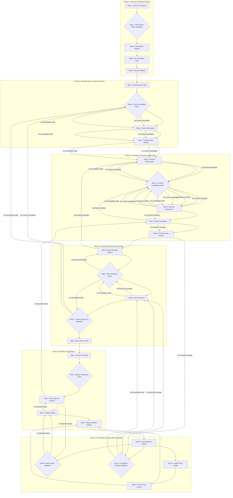

```mermaid
graph TD
    %% === PHASE 1: DISCOVERY & CURATION LAYER ===
    subgraph phase_01 [Phase 1: Discovery & Identity Curation]
        %% Entrance Node
        start_node["Step 1. End-User Customer"]
        
        %% Core Logic: Identity Verification
        identity_check{"Step 1. IAM Security Officer Validation"}
        
        %% Core Logic: Service Area Mapping
        geo_check["Step 2. Geolocation Request"]
        fee_calculator["Step 2. Fee Calculation Logic"]
        
        %% Staging State
        cart_staging["Step 3. Cart Item Staging"]
    end

    %% === PHASE 2: SLOT ALLOCATION & LOGISTICS PLANNING ===
    subgraph phase_02 [Phase 2: Slot Allocation & Logistics Planning]
        %% Entrance Node (Linked from Phase 1 Exit)
        slot_entrance["Step 3. Slot Allocation Logic"]
        
        %% Core Logic: Courier Assignment
        courier_check{"Step 4. Courier Availability Check"}
        route_optimizer["Step 4. Route Optimization"]
        
        %% Staging State
        order_queue["Step 4. Pending Order Header"]
    end

    %% === PHASE 3: TRANSACTION & INVENTORY RESERVATION ===
    subgraph phase_03 [Phase 3: Transaction & Inventory Reservation]
        %% Entrance Node (Linked from Phase 2 Exit)
        txn_entrance["Step 5. Payment Authorization"]
        
        %% Core Logic: Stock Management
        stock_check{"Step 5. Inventory Availability Check"}
        stock_reserve["Step 5. Inventory Reservation"]
        invoice_gen["Step 5. Invoice Generation"]
        
        %% Staging State
        order_finalized["Step 5. Finalized Order Header"]
    end

    %% === PHASE 4: PHYSICAL PICKUP & FLEET EXECUTION ===
    subgraph phase_04 [Phase 4: Physical Pickup & Fleet Execution]
        %% Entrance Node (Linked from Phase 3 Exit)
        pickup_entrance["Step 6. Pickup Manifest Initiation"]
        
        %% Core Logic: Store Operations
        item_scan{"Step 6. Item Verification Check"}
        stock_deduct["Step 6. Batch Deduction"]
        courier_dispatch{"Step 6. Courier Assignment Validation"}
        
        %% Staging State
        in_transit["Step 6. Active Delivery Task"]
    end

    %% === PHASE 5: HANDOVER & SETTLEMENT ===
    subgraph phase_05 [Phase 5: Handover & Settlement]
        %% Entrance Node (Linked from Phase 4 Exit)
        handover_entrance["Step 7. Handover Receipt"]
        
        %% Core Logic: Settlement
        handover_validate{"Step 7. Quality & Signature Check"}
        payment_capture["Step 7. Final Payment Capture"]
        ledger_update["Step 7. Ledger Update"]
        
        %% Staging State
        delivery_complete["Step 7. Delivered Status Update"]
    end

    %% === PHASE 6: POST-SETTLEMENT & EXCEPTION HANDLING ===
    subgraph phase_06 [Phase 6: Post-Settlement & Exception Handling]
        %% Entrance Node (Linked from Phase 5 Exit)
        post_settle_entrance["Step 8. Post-Settlement Actions"]
        
        %% Core Logic: Loyalty & Claims
        loyalty_apply["Step 8. Loyalty Points Ledger"]
        refund_process{"Step 8. Refund Claim Validation"}
        cancel_process{"Step 8. Cancellation Request Validation"}
        
        %% Staging State
        final_closure["Step 8. System State Closure"]
    end

    %% === INTER-COMPONENT LINKING (HUB-AND-SPOKE TOPOLOGY) ===
    %% Phase 1 Connections
    start_node --> identity_check
    identity_check --> geo_check
    geo_check --> fee_calculator
    fee_calculator --> cart_staging
    cart_staging --> slot_entrance

    %% Phase 2 Connections
    slot_entrance --> courier_check
    courier_check --> route_optimizer
    route_optimizer --> order_queue
    order_queue --> txn_entrance

    %% Phase 3 Connections
    txn_entrance --> stock_check
    stock_check --> stock_reserve
    stock_reserve --> invoice_gen
    invoice_gen --> order_finalized
    order_finalized --> pickup_entrance

    %% Phase 4 Connections
    pickup_entrance --> item_scan
    item_scan --> stock_deduct
    stock_deduct --> courier_dispatch
    courier_dispatch --> in_transit
    in_transit --> handover_entrance

    %% Phase 5 Connections
    handover_entrance --> handover_validate
    handover_validate --> payment_capture
    payment_capture --> ledger_update
    ledger_update --> delivery_complete
    delivery_complete --> post_settle_entrance

    %% Phase 6 Connections
    post_settle_entrance --> loyalty_apply
    post_settle_entrance --> refund_process
    post_settle_entrance --> cancel_process
    refund_process --> ledger_update
    cancel_process --> stock_deduct
    loyalty_apply --> final_closure
    final_closure --> delivery_complete

    %% === EXCEPTION HANDLING (CLOSED LOOPS) ===
    %% If stock unavailable after payment (Phase 3 -> Exception)
    stock_check -- "On Inventory Shortage" --> stock_reserve
    stock_reserve -- "On Inventory Shortage" --> invoice_gen
    invoice_gen -- "On Inventory Shortage" --> order_finalized
    order_finalized -- "On Inventory Shortage" --> cancel_process
    cancel_process -- "On Inventory Shortage" --> stock_deduct
    stock_deduct -- "On Inventory Shortage" --> item_scan
    item_scan -- "On Inventory Shortage" --> pickup_entrance
    pickup_entrance -- "On Inventory Shortage" --> txn_entrance
    txn_entrance -- "On Inventory Shortage" --> stock_check

    %% If Payment Failed after Authorization (Phase 3 -> Exception)
    payment_capture -- "On Payment Failure" --> refund_process
    refund_process -- "On Payment Failure" --> ledger_update
    ledger_update -- "On Payment Failure" --> payment_capture
    payment_capture -- "On Payment Failure" --> invoice_gen
    invoice_gen -- "On Payment Failure" --> stock_check
    stock_check -- "On Payment Failure" --> stock_reserve
    stock_reserve -- "On Payment Failure" --> stock_check

    %% If Courier Deviates (Phase 4 -> Exception)
    courier_dispatch -- "On Courier Unavailable" --> courier_check
    courier_check -- "On Courier Unavailable" --> route_optimizer
    route_optimizer -- "On Courier Unavailable" --> order_queue
    order_queue -- "On Courier Unavailable" --> txn_entrance
    txn_entrance -- "On Courier Unavailable" --> stock_check
    stock_check -- "On Courier Unavailable" --> stock_reserve
    stock_reserve -- "On Courier Unavailable" --> stock_check

    %% If Cancellation Request (Phase 5/6 -> Exception)
    cancel_process -- "On Cancellation Valid" --> stock_deduct
    stock_deduct -- "On Cancellation Valid" --> item_scan
    item_scan -- "On Cancellation Valid" --> courier_dispatch
    courier_dispatch -- "On Cancellation Valid" --> courier_check
    courier_check -- "On Cancellation Valid" --> route_optimizer
    route_optimizer -- "On Cancellation Valid" --> order_queue
    order_queue -- "On Cancellation Valid" --> txn_entrance
    txn_entrance -- "On Cancellation Valid" --> stock_check
    stock_check -- "On Cancellation Valid" --> stock_reserve
    stock_reserve -- "On Cancellation Valid" --> stock_check

    %% === TERMINAL NODES (NO FURTHER LINKS) ===
    final_closure --> delivery_complete
```
