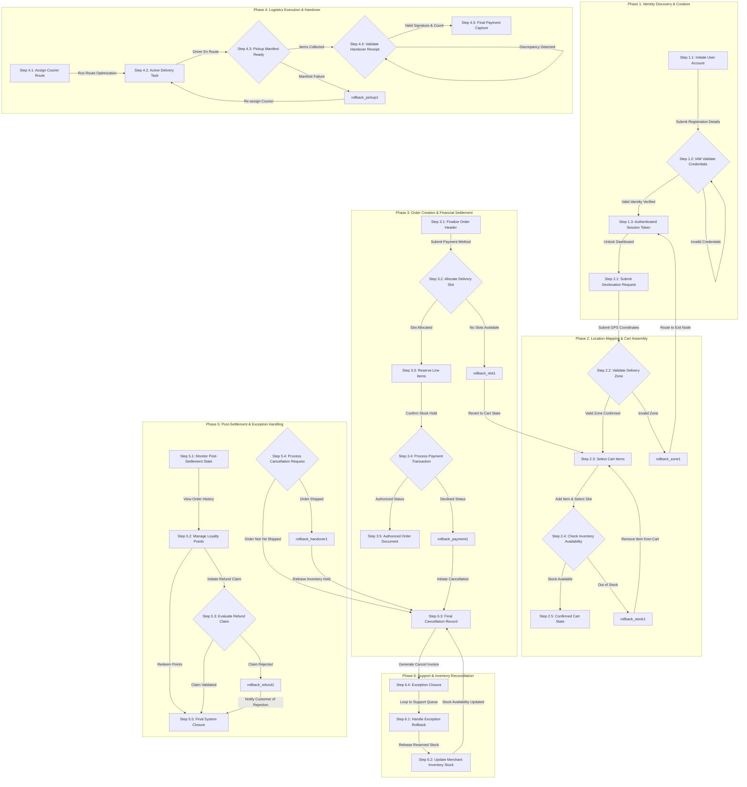

```mermaid
graph TD
    subgraph phase_01 [Phase 1: Identity Discovery & Curation]
        entrance_node1["Step 1.1: Initiate User Account"]
        decision_auth1{"Step 1.2: IAM Validate Credentials"}
        exit_node1["Step 1.3: Authenticated Session Token"]
        
        entrance_node1 -- "Submit Registration Details" --> decision_auth1
        decision_auth1 -- "Valid Identity Verified" --> exit_node1
        decision_auth1 -- "Invalid Credentials" --> decision_auth1
        
        exit_node1 -- "Unlock Dashboard" --> entrance_node2
    end

    subgraph phase_02 [Phase 2: Location Mapping & Cart Assembly]
        entrance_node2["Step 2.1: Submit Geolocation Request"]
        decision_zone1{"Step 2.2: Validate Delivery Zone"}
        cart_node1["Step 2.3: Select Cart Items"]
        decision_stock1{"Step 2.4: Check Inventory Availability"}
        exit_node2["Step 2.5: Confirmed Cart State"]
        
        entrance_node2 -- "Submit GPS Coordinates" --> decision_zone1
        decision_zone1 -- "Valid Zone Confirmed" --> cart_node1
        decision_zone1 -- "Invalid Zone" --> rollback_zone1
        
        cart_node1 -- "Add Item & Select Slot" --> decision_stock1
        decision_stock1 -- "Stock Available" --> exit_node2
        decision_stock1 -- "Out of Stock" --> rollback_stock1
        
        rollback_zone1 -- "Route to Exit Node" --> exit_node1
        rollback_stock1 -- "Remove Item from Cart" --> cart_node1
    end

    subgraph phase_03 [Phase 3: Order Creation & Financial Settlement]
        entrance_node3["Step 3.1: Finalize Order Header"]
        decision_slot1{"Step 3.2: Allocate Delivery Slot"}
        line_item_node1["Step 3.3: Reserve Line Items"]
        decision_payment1{"Step 3.4: Process Payment Transaction"}
        exit_node3["Step 3.5: Authorized Order Document"]
        
        entrance_node3 -- "Submit Payment Method" --> decision_slot1
        decision_slot1 -- "Slot Allocated" --> line_item_node1
        decision_slot1 -- "No Slots Available" --> rollback_slot1
        
        line_item_node1 -- "Confirm Stock Hold" --> decision_payment1
        decision_payment1 -- "Authorized Status" --> exit_node3
        decision_payment1 -- "Declined Status" --> rollback_payment1
        
        rollback_slot1 -- "Revert to Cart State" --> cart_node1
        rollback_payment1 -- "Initiate Cancellation" --> cancellation_node1
    end

    subgraph phase_04 [Phase 4: Logistics Execution & Handover]
        entrance_node4["Step 4.1: Assign Courier Route"]
        courier_node1["Step 4.2: Active Delivery Task"]
        decision_pickup1{"Step 4.3: Pickup Manifest Ready"}
        decision_handover1{"Step 4.4: Validate Handover Receipt"}
        exit_node4["Step 4.5: Final Payment Capture"]
        
        entrance_node4 -- "Run Route Optimization" --> courier_node1
        courier_node1 -- "Driver En Route" --> decision_pickup1
        
        decision_pickup1 -- "Items Collected" --> decision_handover1
        decision_pickup1 -- "Manifest Failure" --> rollback_pickup1
        
        decision_handover1 -- "Valid Signature & Count" --> exit_node4
        decision_handover1 -- "Discrepancy Detected" --> decision_handover1
        
        rollback_pickup1 -- "Re-assign Courier" --> courier_node1
    end

    subgraph phase_05 [Phase 5: Post-Settlement & Exception Handling]
        entrance_node5["Step 5.1: Monitor Post-Settlement State"]
        loyalty_node1["Step 5.2: Manage Loyalty Points"]
        decision_refund1{"Step 5.3: Evaluate Refund Claim"}
        decision_cancel1{"Step 5.4: Process Cancellation Request"}
        exit_node5["Step 5.5: Final System Closure"]
        
        entrance_node5 -- "View Order History" --> loyalty_node1
        loyalty_node1 -- "Redeem Points" --> exit_node5
        
        loyalty_node1 -- "Initiate Refund Claim" --> decision_refund1
        decision_refund1 -- "Claim Validated" --> exit_node5
        decision_refund1 -- "Claim Rejected" --> rollback_refund1
        
        decision_cancel1 -- "Order Not Yet Shipped" --> cancellation_node1
        decision_cancel1 -- "Order Shipped" --> rollback_handover1
        
        rollback_refund1 -- "Notify Customer of Rejection" --> exit_node5
        rollback_handover1 -- "Release Inventory Hold" --> cancellation_node1
    end

    subgraph phase_06 [Phase 6: Support & Inventory Reconciliation]
        entrance_node6["Step 6.1: Handle Exception Rollback"]
        merchant_stock1["Step 6.2: Update Merchant Inventory Stock"]
        cancellation_node1["Step 6.3: Final Cancellation Record"]
        exit_node6["Step 6.4: Exception Closure"]
        
        entrance_node6 -- "Release Reserved Stock" --> merchant_stock1
        merchant_stock1 -- "Stock Availability Updated" --> cancellation_node1
        cancellation_node1 -- "Generate Cancel Invoice" --> exit_node6
        
        exit_node6 -- "Loop to Support Queue" --> entrance_node6
    end
```
