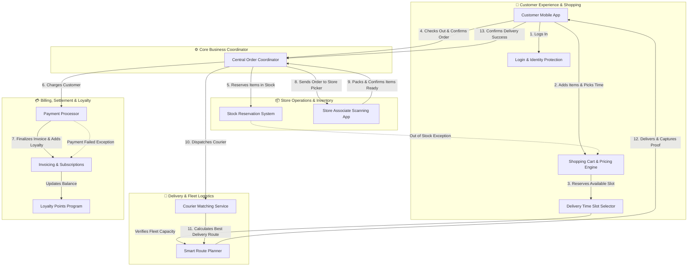

```mermaid
graph TD
    subgraph Domain_Customer["📱 Customer Experience & Shopping"]
        direction TB
        Customer_App[Customer Mobile App]
        User_Auth[Login & Identity Protection]
        Cart_Mgmt[Shopping Cart & Pricing Engine]
        Slot_Mgmt[Delivery Time Slot Selector]
    end

    subgraph Domain_Operations["⚙️ Core Business Coordinator"]
        direction TB
        Orchestrator[Central Order Coordinator]
    end

    subgraph Domain_Inventory["📦 Store Operations & Inventory"]
        direction TB
        Stock_Logic[Stock Reservation System]
        Store_Assoc[Store Associate Scanning App]
    end

    subgraph Domain_Logistics["🚚 Delivery & Fleet Logistics"]
        direction TB
        Courier_Assign[Courier Matching Service]
        Route_Optim[Smart Route Planner]
    end

    subgraph Domain_Finance["💳 Billing, Settlement & Loyalty"]
        direction TB
        Payment_GW[Payment Processor]
        Billing_Cycle[Invoicing & Subscriptions]
        Loyalty_Ledger[Loyalty Points Program]
    end

    %% --- STEP-BY-STEP BUSINESS FLOW ---
    
    %% 1. Shopping & Reservation
    Customer_App -->|1. Logs In| User_Auth
    Customer_App -->|2. Adds Items & Picks Time| Cart_Mgmt
    Cart_Mgmt -->|3. Reserves Available Slot| Slot_Mgmt
    Slot_Mgmt -->|Verifies Fleet Capacity| Route_Optim
    Customer_App -->|4. Checks Out & Confirms Order| Orchestrator

    %% 2. Order Processing & Inventory Hold
    Orchestrator -->|5. Reserves Items in Stock| Stock_Logic
    Orchestrator -->|6. Charges Customer| Payment_GW
    Payment_GW -->|7. Finalizes Invoice & Adds Loyalty| Billing_Cycle
    Billing_Cycle -->|Updates Balance| Loyalty_Ledger

    %% 3. Fulfillment & Logistics
    Orchestrator -->|8. Sends Order to Store Picker| Store_Assoc
    Store_Assoc -->|9. Packs & Confirms Items Ready| Orchestrator
    Orchestrator -->|10. Dispatches Courier| Courier_Assign
    Courier_Assign -->|11. Calculates Best Delivery Route| Route_Optim

    %% 4. Handover & Delivery
    Route_Optim -->|12. Delivers & Captures Proof| Customer_App
    Customer_App -->|13. Confirms Delivery Success| Orchestrator

    %% --- BUSINESS EXCEPTIONS ---
    Stock_Logic -.->|Out of Stock Exception| Cart_Mgmt
    Payment_GW -.->|Payment Failed Exception| Billing_Cycle
```