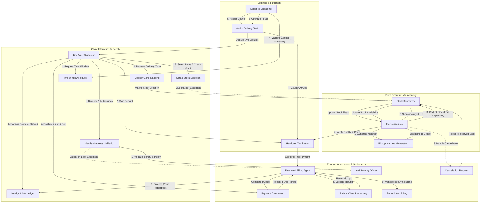

```mermaid
graph TD
    subgraph "Client Interaction & Identity"
        Actor_User["End-User Customer"]
        Obj_UserAccount["Identity & Access Validation"]
        Obj_GeoLocation["Delivery Zone Mapping"]
        Obj_CartItem["Cart & Stock Selection"]
        Obj_DeliverySlot["Time Window Request"]
        Obj_Loyalty["Loyalty Points Ledger"]
    end

    subgraph "Store Operations & Inventory"
        Actor_StoreAssoc["Store Associate"]
        Obj_MerchInventory["Stock Repository"]
        Obj_PickupManifest["Pickup Manifest Generation"]
    end

    subgraph "Logistics & Fulfillment"
        Actor_Dispatcher["Logistics Dispatcher"]
        Obj_AssignedCourier["Active Delivery Task"]
        Obj_HandoverReceipt["Handover Verification"]
    end

    subgraph "Finance, Governance & Settlements"
        Actor_Finance["Finance & Billing Agent"]
        Obj_PaymentTrans["Payment Transaction"]
        Obj_RefundClaim["Refund Claim Processing"]
        Obj_Subscription["Subscription Billing"]
        Actor_Security["IAM Security Officer"]
        Obj_CancellationReq["Cancellation Request"]
    end

    %% PHASE 1: Onboarding & Authentication
    Actor_User -->|1. Register & Authenticate| Obj_UserAccount
    Actor_Security -->|1. Validate Identity & Policy| Obj_UserAccount
    Obj_UserAccount -.->|Validation Error Exception| Actor_Security

    %% PHASE 2: Service Configuration
    Actor_User -->|2. Request Delivery Zone| Obj_GeoLocation
    Obj_GeoLocation -->|Map to Stock Location| Obj_MerchInventory
    Actor_User -->|3. Select Items & Check Stock| Obj_CartItem
    Obj_CartItem -.->|Out of Stock Exception| Obj_MerchInventory

    %% PHASE 3: Scheduling & Financial Lock
    Actor_User -->|4. Request Time Window| Obj_DeliverySlot
    Actor_Dispatcher -->|4. Validate Courier Availability| Obj_DeliverySlot
    Actor_User -->|5. Finalize Order & Pay| Obj_PaymentTrans
    Obj_PaymentTrans -->|Process Fund Transfer| Actor_Finance
    Actor_Finance -->|Generate Invoice| Obj_PaymentTrans

    %% PHASE 4: Logistics Orchestration
    Actor_Dispatcher -->|5. Assign Courier| Obj_AssignedCourier
    Actor_Dispatcher -->|6. Optimize Route| Obj_AssignedCourier
    Obj_AssignedCourier -->|Update Live Location| Actor_User

    %% PHASE 5: Store Execution
    Actor_StoreAssoc -->|1. Generate Manifest| Obj_PickupManifest
    Obj_PickupManifest -->|List Items to Collect| Actor_StoreAssoc
    Actor_StoreAssoc -->|2. Scan & Verify SKUs| Obj_MerchInventory
    Actor_StoreAssoc -->|3. Deduct Stock from Repository| Obj_MerchInventory
    Obj_MerchInventory -->|Update Stock Flags| Actor_StoreAssoc

    %% PHASE 6: Delivery & Handover
    Obj_AssignedCourier -->|7. Courier Arrives| Obj_HandoverReceipt
    Actor_StoreAssoc -->|7. Verify Quality & Count| Obj_HandoverReceipt
    Actor_User -->|7. Sign Receipt| Obj_HandoverReceipt
    Obj_HandoverReceipt -->|Capture Final Payment| Actor_Finance

    %% PHASE 7: Post-Order Lifecycle (Exceptions & Services)
    Actor_User -->|8. Manage Points or Refund| Obj_Loyalty
    Actor_Finance -->|8. Process Point Redemption| Obj_Loyalty
    Actor_Finance -->|8. Validate Refund| Obj_RefundClaim
    Obj_RefundClaim -->|Reversal Logic| Actor_Finance
    Actor_StoreAssoc -.->|8. Handle Cancellation| Obj_CancellationReq
    Obj_CancellationReq -->|Release Reserved Stock| Obj_MerchInventory
    Obj_MerchInventory -->|Update Stock Availability| Actor_StoreAssoc
    Actor_Finance -->|8. Manage Recurring Billing| Obj_Subscription
```