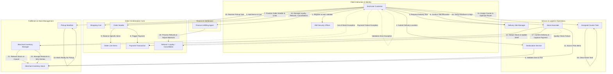

```mermaid
graph TD
    subgraph "Client Interaction & Identity"
        C1[End-User Customer]
        IAM_Officer[IAM Security Officer]
    end

    subgraph "Service & Logistics Operations"
        Geo[Geolocation Service]
        Slot_Mgr[Delivery Slot Manager]
        Courier_Assign[Assigned Courier Task]
        Store_Assoc[Store Associate]
    end

    subgraph "Order Orchestration Core"
        Cart[Shopping Cart]
        Order_Header[Order Header]
        Order_Lines[Order Line Items]
        Payment[Payment Transaction]
        Refund[Refund / Loyalty / Cancellation]
    end

    subgraph "Fulfillment & Stock Management"
        Pickup[Pickup Manifest]
        Store_Stock[Merchant Inventory Stock]
        Store_Mgr[Merchant Inventory Manager]
    end

    subgraph "Finance & Settlement"
        Finance[Finance & Billing Agent]
    end

    %% START: Identity & Access
    C1 -->|1. Register & Auth Validate| IAM_Officer
    C1 -->|2. Submit Delivery Location| Geo

    %% Logistics: Zone & Slot
    Geo -->|3. Validate Zone & Fee| Store_Stock
    C1 -->|4. Request Delivery Slot| Slot_Mgr

    %% Core: Cart & Order Creation
    C1 -->|5. Add Items to Cart| Cart
    C1 -->|6. Confirm Slot Allocation| Slot_Mgr
    C1 -->|7. Finalize Order Header & Lines| Order_Header
    Order_Header -->|8. Trigger Payment| Payment
    Order_Header -->|9. Reserve Specific Items| Order_Lines

    %% Fulfillment: Picking & Stock Deduction
    C1 -->|10. Receive Pickup Task| Pickup
    Store_Assoc -->|11. Scan & Pick Items| Store_Stock
    Store_Assoc -->|12. Deduct Stock & Update Shelf| Store_Mgr
    Pickup -->|13. Mark Ready for Pickup| Pickup

    %% Logistics: Assignment & Transit
    C1 -->|14. Assign Courier & Optimize Route| Courier_Assign
    Courier_Assign -->|15. Track Driver Location| Courier_Assign

    %% Completion: Handover
    C1 -->|16. Verify Handover & Sign| Store_Assoc
    Store_Assoc -->|17. Confirm Delivery & Capture Payment| Payment
    Courier_Assign -->|18. Clear Active Task| Courier_Assign

    %% Post-Transaction: Finance & Support
    C1 -->|19. Manage Loyalty, Refunds, Cancellations| Finance
    Finance -->|20. Process Refunds & Adjust Balances| Refund
    Store_Mgr -->|21. Release Stock on Cancel| Store_Stock
    Store_Mgr -->|22. Manage Restocks & SKU Entries| Store_Stock

    %% Error/Exception Paths (Simplified)
    C1 -.->|Validation Error Exception| C1
    C1 -.->|Payment Failure Exception| Payment
    Store_Assoc -.->|Quality Check Failure| Refund
    Store_Mgr -.->|Out-of-Stock Exception| C1

    %% Global Monotonic Step Numbering Continues Here (1-22)
    %% Note: Steps 1-22 are strictly sequential across the main flow.
    %% Steps 23+ would apply if extended scenarios were added.
```