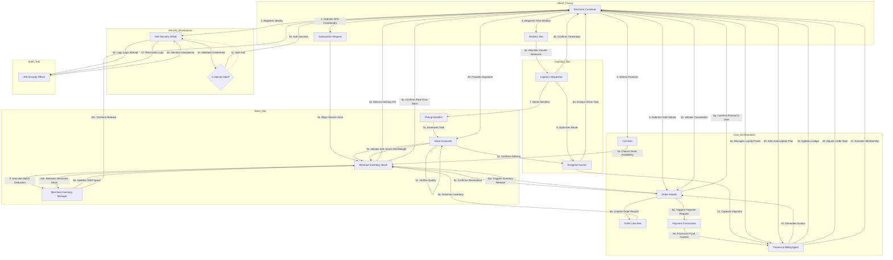

```mermaid
graph TD
    %% ==============================================================================
    %% SUBGRAPH: CLIENT INTERACTION (End-User Actions)
    %% ==============================================================================
    subgraph Client_Facing
        direction TB
        CU[End-User Customer]
    end

    %% ==============================================================================
    %% SUBGRAPH: IDENTITY & ACCESS VALIDATION (Security)
    %% ==============================================================================
    subgraph Security_Governance
        direction TB
        IAM[IAM Security Officer]
        Auth_Node{Is Identity Valid?}
    end

    %% ==============================================================================
    %% SUBGRAPH: CLIENT INTERACTION (Location & Slot Booking)
    %% ==============================================================================
    subgraph Client_Facing
        direction TB
        Geo[Geolocation Request]
        Slot[Delivery Slot]
    end

    %% ==============================================================================
    %% SUBGRAPH: CORE ORCHESTRATION (Cart, Order, Payment)
    %% ==============================================================================
    subgraph Core_Orchestration
        direction TB
        Cart[Cart Item]
        Header[Order Header]
        LineItem[Order Line Item]
        Pay[Payment Transaction]
        Fin[Finance & Billing Agent]
    end

    %% ==============================================================================
    %% SUBGRAPH: LOGISTICS & FLEET MANAGEMENT
    %% ==============================================================================
    subgraph Logistics_Ops
        direction TB
        Disp[Logistics Dispatcher]
        Courier[Assigned Courier]
    end

    %% ==============================================================================
    %% SUBGRAPH: STORE OPERATIONS & INVENTORY
    %% ==============================================================================
    subgraph Store_Ops
        direction TB
        Manifest[Pickup Manifest]
        Stock[Merchant Inventory Stock]
        Assoc[Store Associate]
        InvMgmt[Merchant Inventory Manager]
    end

    %% ==============================================================================
    %% SUBGRAPH: AUDIT & GOVERNANCE
    %% ==============================================================================
    subgraph Audit_Trail
        direction TB
        Audit[IAM Security Officer]
    end

    %% ==============================================================================
    %% CHRONOLOGICAL JOURNEY TRACK (Strict Monotonic Step Numbering)
    %% ==============================================================================

    %% PHASE 1: REGISTRATION & AUTH
    CU -->|1. Registers Identity| IAM
    IAM -->|1a. Validates Credentials| Auth_Node
    Auth_Node -->|1b. Auth Success| CU
    Auth_Node -.->|1c. Auth Fail| IAM
    IAM -->|1d. Logs Login Attempt| Audit

    %% PHASE 2: ZONE VALIDATION
    CU -->|2. Submits GPS Coordinates| Geo
    Geo -->|2a. Maps Service Zone| Stock
    Stock -->|2b. Returns Delivery Pin| CU

    %% PHASE 3: BROWSING & SLOT ALLOCATION
    CU -->|3. Selects Products| Cart
    Cart -->|3a. Checks Stock Availability| Stock
    Stock -->|3b. Confirms Real-Time Stock| CU

    CU -->|4. Requests Time Window| Slot
    Slot -->|4a. Allocates Courier Resource| Disp
    Disp -->|4b. Confirms Timestamp| CU

    %% PHASE 4: ORDER CREATION & PAYMENT
    CU -->|5. Submits Order Details| Header
    Header -->|5a. Creates Order Record| LineItem
    LineItem -->|5b. Reserves Inventory| Stock
    Stock -->|5c. Confirms Reservation| Header
    Header -->|5d. Triggers Payment Request| Pay
    Pay -->|5e. Processes Fund Transfer| Fin
    Fin -->|5f. Generates Invoice| Header
    Header -->|5g. Confirms Receipt to User| CU

    %% PHASE 5: LOGISTICS ASSIGNMENT
    Disp -->|6. Optimizes Route| Courier
    Courier -->|6a. Assigns Driver Task| CU

    %% PHASE 6: PICKUP PREPARATION
    Disp -->|7. Sends Manifest| Manifest
    Manifest -->|7a. Generates Task| Assoc
    Assoc -->|7b. Initiates Scan| Stock

    %% PHASE 7: INVENTORY DEDUCTION (Happy Path)
    Assoc -->|8. Scans SKU/Weight| Stock
    Stock -->|9. Executes Batch Deduction| InvMgmt
    InvMgmt -->|9a. Updates Shelf Space| Stock

    %% PHASE 8: HANDOVER & FINALIZATION
    CU -->|10. Provides Signature| Assoc
    Assoc -->|11. Verifies Quality| Assoc
    Assoc -->|12. Confirms Delivery| Courier
    Courier -->|13. Captures Payment| Fin
    Fin -->|14. Updates Ledger| CU

    %% PHASE 9: POST-ORDER / EXCEPTION FLOW
    CU -->|15. Initiates Cancellation| Header
    Header -->|15a. Triggers Inventory Release| Stock
    Stock -->|15b. Releases Reserved Stock| InvMgmt
    InvMgmt -->|15c. Confirms Release| CU

    %% SUBGRAPH: AUDIT & GOVERNANCE (Parallel)
    Audit -->|16. Monitors Compliance| IAM
    IAM -->|17. Reconciles Logs| Audit

    %% SUBGRAPH: RECURRING & LOYALTY
    CU -->|18. Manages Loyalty Points| Fin
    Fin -->|19. Adjusts Order Total| CU
    CU -->|20. Sets Subscription Plan| Fin
    Fin -->|21. Activates Membership| CU
```