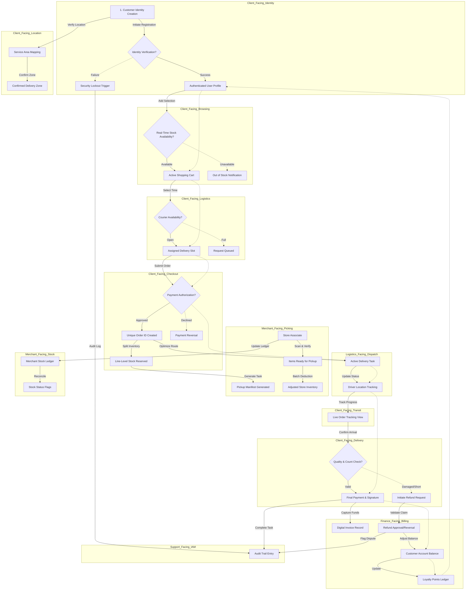

```mermaid
graph TD
    subgraph Client_Facing_Identity
        User_1[1. Customer Identity Creation] -->|Initiate Registration| IAM_Check{Identity Verification?}
        IAM_Check -->|Success| User_Profile[Authenticated User Profile]
        IAM_Check -.->|Failure| IAM_Alert[Security Lockout Trigger]
    end

    subgraph Client_Facing_Location
        User_1 -->|Verify Location| Geo_Calc[Service Area Mapping]
        Geo_Calc -->|Confirm Zone| Delivery_Pin[Confirmed Delivery Zone]
    end

    subgraph Client_Facing_Browsing
        User_Profile -->|Add Selection| Stock_Check{Real-Time Stock Availability?}
        Stock_Check -->|Available| Cart_Updated[Active Shopping Cart]
        Stock_Check -.->|Unavailable| Stock_Alert[Out of Stock Notification]
    end

    subgraph Client_Facing_Logistics
        Cart_Updated -->|Select Time| Slot_Avail{Courier Availability?}
        Slot_Avail -->|Open| Slot_Assigned[Assigned Delivery Slot]
        Slot_Avail -.->|Full| Slot_Waitlist[Request Queued]
    end

    subgraph Client_Facing_Checkout
        Slot_Assigned -->|Submit Order| Payment_Auth{Payment Authorization?}
        Payment_Auth -->|Approved| Order_Created[Unique Order ID Created]
        Payment_Auth -.->|Declined| Refund_Clip[Payment Reversal]
        Order_Created -->|Split Inventory| Line_Reserved[Line-Level Stock Reserved]
    end

    subgraph Merchant_Facing_Picking
        Line_Reserved -->|Generate Task| Pickup_Manifest[Pickup Manifest Generated]
        Store_Assoc[Store Associate] -->|Scan & Verify| Manifest_Ready[Items Ready for Pickup]
        Manifest_Ready -->|Batch Deduction| Stock_Adjusted[Adjusted Store Inventory]
    end

    subgraph Logistics_Facing_Dispatch
        Order_Created -->|Optimize Route| Courier_Assigned[Active Delivery Task]
        Courier_Assigned -->|Update Status| Driver_Location[Driver Location Tracking]
    end

    subgraph Merchant_Facing_Stock
        Store_Assoc -->|Update Ledger| Stock_Ledger[Merchant Stock Ledger]
        Stock_Ledger -->|Reconcile| Stock_Report[Stock Status Flags]
    end

    subgraph Client_Facing_Transit
        Driver_Location -->|Track Progress| Order_Status[Live Order Tracking View]
    end

    subgraph Client_Facing_Delivery
        Order_Status -->|Confirm Arrival| Handover_Req{Quality & Count Check?}
        Handover_Req -->|Valid| Handover_Final[Final Payment & Signature]
        Handover_Req -.->|Damaged/Short| Refund_Claim[Initiate Refund Request]
    end

    subgraph Finance_Facing_Billing
        Handover_Final -->|Capture Funds| Invoice_Gen[Digital Invoice Record]
        Refund_Claim -->|Validate Claim| Refund_Process[Refund Approval/Reversal]
        Refund_Process -->|Adjust Balance| Account_Ledger[Customer Account Balance]
        Account_Ledger -->|Update| Loyalty_Ledger[Loyalty Points Ledger]
    end

    subgraph Support_Facing_IAM
        IAM_Alert -->|Audit Log| Audit_Tail[Audit Trail Entry]
        Handover_Final -->|Complete Task| Audit_Tail
        Refund_Process -->|Flag Dispute| Audit_Tail
    end

    %% Cross-Linking for Context
    User_Profile -.-> Cart_Updated
    Cart_Updated -.-> Slot_Assigned
    Slot_Assigned -.-> Payment_Auth
    Payment_Auth -.-> Courier_Assigned
    Courier_Assigned -.-> Driver_Location
    Driver_Location -.-> Handover_Final
    Handover_Final -.-> Account_Ledger
    Account_Ledger -.-> Loyalty_Ledger
    Loyalty_Ledger -.-> User_Profile
```