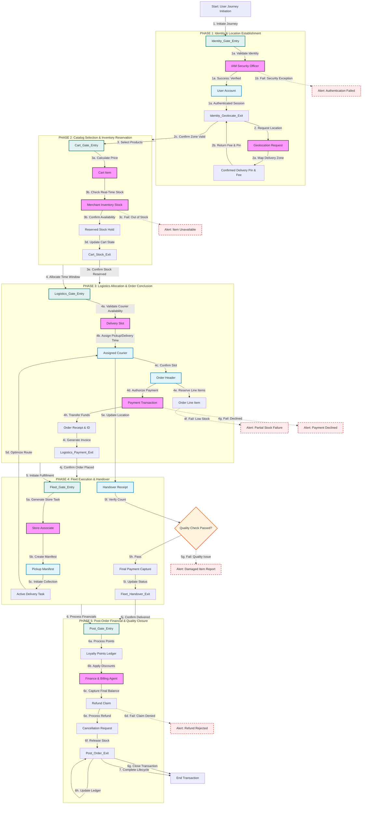

```mermaid
graph TD
    %% GLOBAL ENTRY GATEWAY
    Start["Start: User Journey Initiation"]

    %% %% PHASE 1: IDENTITY & LOCATION ESTABLISHMENT
    subgraph Phase1_Identity_Geolocate["PHASE 1: Identity & Location Establishment"]
        ID_Gate["Identity_Gate_Entry"]
        IAM_Handler["IAM Security Officer"]
        User_Profile["User Account"]
        Geo_Handler["Geolocation Request"]
        Geo_Output["Confirmed Delivery Pin & Fee"]
        ID_Exit["Identity_Geolocate_Exit"]
    end

    %% %% PHASE 2: CATALOG SELECTION & INVENTORY RESERVATION
    subgraph Phase2_Cart_Stock["PHASE 2: Catalog Selection & Inventory Reservation"]
        Cart_Gate["Cart_Gate_Entry"]
        Cart_Handler["Cart Item"]
        Inventory_Handler["Merchant Inventory Stock"]
        Stock_Output["Reserved Stock Hold"]
        Cart_Exit["Cart_Stock_Exit"]
    end

    %% %% PHASE 3: LOGISTICS ALLOCATION & ORDER CONCLUSION
    subgraph Phase3_Logistics_Payment["PHASE 3: Logistics Allocation & Order Conclusion"]
        Log_Gate["Logistics_Gate_Entry"]
        Slot_Handler["Delivery Slot"]
        Order_Header["Order Header"]
        Order_Line["Order Line Item"]
        Payment_Handler["Payment Transaction"]
        Courier_Assign["Assigned Courier"]
        Order_Final["Order Receipt & ID"]
        Log_Exit["Logistics_Payment_Exit"]
    end

    %% %% PHASE 4: FLEET EXECUTION & HANDOVER
    subgraph Phase4_Fleet_Handover["PHASE 4: Fleet Execution & Handover"]
        Fleet_Gate["Fleet_Gate_Entry"]
        Store_Associate["Store Associate"]
        Pickup_Manifest["Pickup Manifest"]
        Courier_Task["Active Delivery Task"]
        Handover_Recpt["Handover Receipt"]
        Payment_Capture["Final Payment Capture"]
        Fleet_Exit["Fleet_Handover_Exit"]
    end

    %% %% PHASE 5: POST-ORDER FINANCIAL & QUALITY CLOSURE
    subgraph Phase5_PostOrder["PHASE 5: Post-Order Financial & Quality Closure"]
        Post_Gate["Post_Gate_Entry"]
        Finance_Handler["Finance & Billing Agent"]
        Loyalty_Handler["Loyalty Points Ledger"]
        Refund_Handler["Refund Claim"]
        Cancel_Handler["Cancellation Request"]
        Post_Exit["Post_Order_Exit"]
    end

    %% LINKS: ENTRY TO PHASE 1
    Start -->|1. Initiate Journey| ID_Gate
    ID_Gate -->|1a. Validate Identity| IAM_Handler
    IAM_Handler -.->|1b. Fail: Security Exception| Alert_Error["Alert: Authentication Failed"]
    IAM_Handler -->|1a. Success: Verified| User_Profile
    User_Profile -->|1a. Authenticated Session| ID_Exit
    
    ID_Exit -->|2. Request Location| Geo_Handler
    Geo_Handler -->|2a. Map Delivery Zone| Geo_Output
    Geo_Output -->|2b. Return Fee & Pin| ID_Exit
    ID_Exit -->|2c. Confirm Zone Valid| Phase2_Cart_Stock

    %% LINKS: PHASE 1 TO PHASE 2
    Phase2_Cart_Stock

    %% LINKS: ENTRY TO PHASE 2
    Phase1_Identity_Geolocate -->|3. Select Products| Cart_Gate
    Cart_Gate -->|3a. Calculate Price| Cart_Handler
    Cart_Handler -->|3b. Check Real-Time Stock| Inventory_Handler
    Inventory_Handler -.->|3c. Fail: Out of Stock| Alert_Stock["Alert: Item Unavailable"]
    Inventory_Handler -->|3b. Confirm Availability| Stock_Output
    Stock_Output -->|3d. Update Cart State| Cart_Exit
    Cart_Exit -->|3e. Confirm Stock Reserved| Phase3_Logistics_Payment

    %% LINKS: PHASE 2 TO PHASE 3
    Phase3_Logistics_Payment

    %% LINKS: ENTRY TO PHASE 3
    Phase2_Cart_Stock -->|4. Allocate Time Window| Log_Gate
    Log_Gate -->|4a. Validate Courier Availability| Slot_Handler
    Slot_Handler -->|4b. Assign Pickup/Delivery Time| Courier_Assign
    Courier_Assign -->|4c. Confirm Slot| Order_Header
    Order_Header -->|4d. Authorize Payment| Payment_Handler
    Order_Header -->|4e. Reserve Line Items| Order_Line
    Order_Line -.->|4f. Fail: Low Stock| Alert_Line["Alert: Partial Stock Failure"]
    Payment_Handler -.->|4g. Fail: Declined| Alert_Payment["Alert: Payment Declined"]
    Payment_Handler -->|4h. Transfer Funds| Order_Final
    Order_Final -->|4i. Generate Invoice| Log_Exit
    Log_Exit -->|4j. Confirm Order Placed| Phase4_Fleet_Handover

    %% LINKS: PHASE 3 TO PHASE 4
    Phase4_Fleet_Handover

    %% LINKS: ENTRY TO PHASE 4
    Phase3_Logistics_Payment -->|5. Initiate Fulfillment| Fleet_Gate
    Fleet_Gate -->|5a. Generate Store Task| Store_Associate
    Store_Associate -->|5b. Create Manifest| Pickup_Manifest
    Pickup_Manifest -->|5c. Initiate Collection| Courier_Task
    Courier_Task -->|5d. Optimize Route| Courier_Assign
    Courier_Assign -->|5e. Update Location| Handover_Recpt
    
    %% Validation Diamond in Handover
    Decision_Handover{"Quality Check Passed?"}
    Handover_Recpt -->|5f. Verify Count| Decision_Handover
    Decision_Handover -.->|5g. Fail: Quality Issue| Alert_Quality["Alert: Damaged Item Report"]
    Decision_Handover -->|5h. Pass| Payment_Capture
    Payment_Capture -->|5i. Update Status| Fleet_Exit
    Fleet_Exit -->|5j. Confirm Delivered| Phase5_PostOrder

    %% LINKS: PHASE 4 TO PHASE 5
    Phase5_PostOrder

    %% LINKS: ENTRY TO PHASE 5
    Phase4_Fleet_Handover -->|6. Process Financials| Post_Gate
    Post_Gate -->|6a. Process Points| Loyalty_Handler
    Loyalty_Handler -->|6b. Apply Discounts| Finance_Handler
    Finance_Handler -->|6c. Capture Final Balance| Refund_Handler
    Refund_Handler -.->|6d. Fail: Claim Denied| Alert_Claim["Alert: Refund Rejected"]
    Refund_Handler -->|6e. Process Refund| Cancel_Handler
    Cancel_Handler -->|6f. Release Stock| Post_Exit
    Post_Exit -->|6g. Close Transaction| End_Next["End Transaction"]
    Post_Exit -->|6h. Update Ledger| Post_Exit

    %% FINAL EXIT
    Post_Exit -->|7. Complete Lifecycle| End_Next

    %% Styling for readability
    classDef actor fill:#f9f,stroke:#333,stroke-width:2px;
    classDef system fill:#e1f5fe,stroke:#0277bd,stroke-width:2px;
    classDef process fill:#fff9c4,stroke:#fbc02d,stroke-width:2px;
    classDef gate fill:#e0f2f1,stroke:#00695c,stroke-width:2px;
    classDef alert fill:#ffebee,stroke:#c62828,stroke-width:2px,stroke-dasharray: 5 5;
    classDef decision fill:#fff3e0,stroke:#e65100,stroke-width:2px,shape:diamond;

    class IAM_Handler,Geo_Handler,Inventory_Handler,Cart_Handler,Slot_Handler,Payment_Handler,Store_Associate,Finance_Handler actor;
    class User_Profile,Order_Header,Courier_Assign,Pickup_Manifest,Handover_Recpt system;
    class ID_Gate,Cart_Gate,Log_Gate,Fleet_Gate,Post_Gate gate;
    class Alert_Error,Alert_Stock,Alert_Payment,Alert_Line,Alert_Quality,Alert_Claim alert;
    class Decision_Handover decision;
```