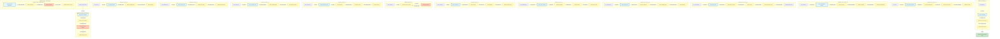

```mermaid
graph TD
    %% PHASE 1: IDENTITY & ACCESS GOVERNANCE
    subgraph Subgraph_Identity_Authentication
        subgraph Subgraph_Identity_Authentication_01
            Input_Register[Input: Customer Registration] -->|1. Submit Credentials| Node_UserAccount_1["Identity Verification"]
            Node_UserAccount_1 -->|1a. Validate Policy| Node_IAM_1["IAM Security Officer"]
            Node_IAM_1 -->|1b. Issue Token| Output_Session_1["Authenticated User Context"]
        end
        Exit_Register[Output: Session Active]
    end

    subgraph Subgraph_Identity_Authentication_02
        %% Internal Routing
        Exit_Register -->|1. Forward| Input_Geo_1
        Input_Geo_1["Input: GPS Coordinates"] -->|2. Zone Validation| Node_Geo_1["Delivery Zone Mapping"]
        Node_Geo_1 -->|2a. Validate Region| Node_Inventory_1["Merchant Inventory Manager"]
        Node_Inventory_1 -->|2b. Check Bounds| Output_Pin_1["Confirmed Delivery Pin"]
    end

    %% PHASE 2: CART & INVENTORY PREPARATION
    subgraph Subgraph_Cart_Inventory_01
        Exit_Pin_1 -->|3. Proceed| Input_Cart_1["Input: Product Selection"]
        Input_Cart_1 -->|3. Add to Cart| Node_Cart_1["Cart Item Management"]
        Node_Cart_1 -->|3a. Price Calc| Node_Stock_1["Real-time Stock Check"]
        Node_Stock_1 -->|3b. Confirm Availability| Output_CartState_1["Updated Cart State"]
    end

    subgraph Subgraph_Cart_Inventory_02
        Exit_CartState_1 -->|4. Select Time| Input_Slot_1["Input: Time Window Request"]
        Input_Slot_1 -->|4. Allocation Logic| Node_Slot_1["Delivery Slot Logic"]
        Node_Slot_1 -->|4a. Check Availability| Node_Dispatcher_1["Logistics Dispatcher"]
        Node_Dispatcher_1 -->|4b. Assign Window| Output_Timestamps_1["Assigned Pickup/Delivery"]
    end

    subgraph Subgraph_Cart_Inventory_03
        Exit_Timestamps_1 -->|5. Checkout| Input_Header_1["Input: Order Details"]
        Input_Header_1 -->|5. Create Order| Node_Header_1["Order Header Creation"]
        Node_Header_1 -->|5a. Calculate Total| Node_LineItem_1["Order Line Item"]
        Node_LineItem_1 -->|5b. Reserve Stock| Node_Stock_2["Merchant Inventory Stock"]
        Node_Stock_2 -->|5c. Deduct Quantity| Output_StockFlags_1["Adjusted Stock Status"]
    end

    subgraph Subgraph_Cart_Inventory_04
        Exit_StockFlags_1 -->|6. Payment| Input_Payment_1["Input: Payment Data"]
        Input_Payment_1 -->|6. Process Funds| Node_Payment_1["Payment Transaction"]
        Node_Payment_1 -->|6a. Verify Gateway| Node_Finance_1["Finance & Billing Agent"]
        Node_Finance_1 -->|6b. Generate Invoice| Output_OrderReceipt_1["Unique Order ID"]
    end

    %% PHASE 3: LOGISTICS & FLEET MANAGEMENT
    subgraph Subgraph_Logistics_01
        Exit_OrderReceipt_1 -->|7. Assign Driver| Input_Courier_1["Input: Order + Address"]
        Input_Courier_1 -->|7. Route Opt| Node_Dispatcher_2["Logistics Dispatcher"]
        Node_Dispatcher_2 -->|7a. Match Driver| Node_Courier_1["Assigned Courier"]
        Node_Courier_1 -->|7b. Start Task| Output_CourierID_1["Active Delivery Task"]
    end

    subgraph Subgraph_Logistics_02
        Exit_CourierID_1 -->|8. Pickup| Input_Manifest_1["Input: Collection List"]
        Input_Manifest_1 -->|8. Generate Task| Node_Store_1["Store Associate"]
        Node_Store_1 -->|8a. Locate Items| Node_Manifest_1["Pickup Manifest"]
        Node_Manifest_1 -->|8b. Verify Count| Output_Collected_1["Ready-for-Pickup Status"]
    end

    %% PHASE 4: HANDOVER & SETTLEMENTS
    subgraph Subgraph_Handover_01
        Exit_Collected_1 -->|9. Transit| Output_CourierLoc_1["Real-time Driver Location"]
        Output_CourierLoc_1 -.->|9a. Monitor| Node_Dispatcher_3["Logistics Dispatcher"]
        Node_Dispatcher_3 -->|9b. Update Route| Output_CourierLoc_1
    end

    subgraph Subgraph_Handover_02
        Exit_CourierLoc_1 -.->|10. Arrive| Input_Handover_1["Input: Handover Receipt"]
        Input_Handover_1 -->|10. Verify| Node_Store_2["Store Associate"]
        Node_Store_2 -->|10a. Quality Check| Node_Handover_1["Handover Receipt"]
        Node_Handover_1 -->|10b. Confirm Delivery| Output_Delivered_1["Delivered Status"]
    end

    subgraph Subgraph_Handover_03
        Exit_Delivered_1 -->|11. Finalize| Input_Finance_2["Input: Settlement Data"]
        Input_Finance_2 -->|11. Capture Payment| Node_Finance_2["Finance & Billing Agent"]
        Node_Finance_2 -->|11a. Clear Liability| Output_FinalReceipt_1["Final Payment Capture"]
    end

    %% PHASE 5: POST-ORDER & EXCEPTION HANDLING
    subgraph Subgraph_PostOrder_01
        Exit_FinalReceipt_1 -.->|12. Loyalty| Input_Loyalty_1["Input: Purchase Total"]
        Input_Loyalty_1 -->|12. Calculate Points| Node_Loyalty_1["Loyalty Points Ledger"]
        Node_Loyalty_1 -->|12a. Apply Discount| Output_Points_1["Updated Points Balance"]
    end

    subgraph Subgraph_PostOrder_02
        Exit_Points_1 -.->|13. Return| Input_Refund_1["Input: Refund Claim"]
        Input_Refund_1 -->|13. Validate Claim| Node_Finance_3["Finance & Billing Agent"]
        Node_Finance_3 -->|13a. Process Reversal| Output_Refund_1["Refund Approval"]
    end

    subgraph Subgraph_PostOrder_03
        Exit_Refund_1 -.->|14. Cancel| Input_Cancel_1["Input: Cancellation"]
        Input_Cancel_1 -->|14. Release Stock| Node_Stock_3["Merchant Inventory Stock"]
        Node_Stock_3 -->|14a. Free Up Inventory| Output_Cancelled_1["Cancelled Order Status"]
    end

    %% FINAL CLOSURE
    Output_Cancelled_1 -->|15. End| Node_End_1["🏁 End Transaction Registry Close"]

    %% STYLING
    classDef userNode fill:#e1f5fe,stroke:#01579b,stroke-width:2px;
    classDef sysNode fill:#fff9c4,stroke:#fbc02d,stroke-width:2px;
    classDef decisionNode fill:#ffccbc,stroke:#d84315,stroke-width:2px;
    classDef endNode fill:#c8e6c9,stroke:#2e7d32,stroke-width:2px;

    class Input_Register,Input_Geo_1,Input_Cart_1,Input_Slot_1,Input_Header_1,Input_Payment_1,Input_Courier_1,Input_Manifest_1,Input_Handover_1,Input_Finance_2,Input_Loyalty_1,Input_Refund_1,Input_Cancel_1 userNode;
    class Node_UserAccount_1,Node_Geo_1,Node_Cart_1,Node_Slot_1,Node_Header_1,Node_LineItem_1,Node_Stock_1,Node_Stock_2,Node_Payment_1,Node_Finance_1,Node_Dispatcher_1,Node_Courier_1,Node_Store_1,Node_Manifest_1,Node_Dispatcher_2,Node_Store_2,Node_Handover_1,Node_Finance_2,Node_Loyalty_1,Node_Finance_3,Node_Stock_3,Node_End_1 sysNode;
    class Node_IAM_1,Node_Inventory_1,Node_Dispatcher_3 sysNode;
    class Output_Session_1,Output_Pin_1,Output_CartState_1,Output_Timestamps_1,Output_OrderReceipt_1,Output_CourierID_1,Output_Collected_1,Output_CourierLoc_1,Output_Delivered_1,Output_FinalReceipt_1,Output_Points_1,Output_Refund_1,Output_Cancelled_1 sysNode;
    class Node_IAM_1,Node_Inventory_1,Node_Dispatcher_3 decisionNode;
    class Node_End_1 endNode;

```