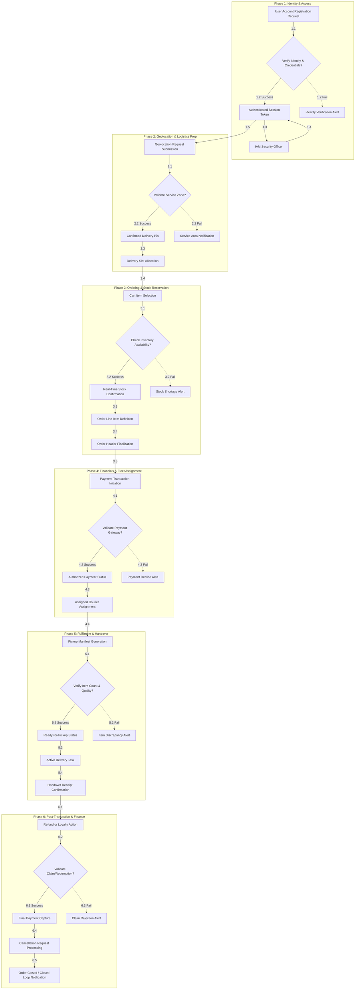

```mermaid
graph TD
    %% --- PHASE 1: INITIALIZATION & AUTHENTICATION ---
    subgraph subgraph_auth_init [Phase 1: Identity & Access]
        EntrAuth_01["User Account Registration Request"]
        AuthNode_01{"Verify Identity & Credentials?"}
        AuthNode_Success_01["Authenticated Session Token"]
        AuthNode_Fail_01["Identity Verification Alert"]
        SecurityNode_01["IAM Security Officer"]
    end

    %% --- PHASE 2: GEO-SERVING & LOGISTICS PREP ---
    subgraph subgraph_geo_logistics [Phase 2: Geolocation & Logistics Prep]
        EntrGeo_01["Geolocation Request Submission"]
        GeoNode_01{"Validate Service Zone?"}
        GeoNode_Success_01["Confirmed Delivery Pin"]
        GeoNode_Fail_01["Service Area Notification"]
        SlotNode_01["Delivery Slot Allocation"]
    end

    %% --- PHASE 3: ORDERING & INVENTORY RESERVATION ---
    subgraph subgraph_order_stock [Phase 3: Ordering & Stock Reservation]
        EntrOrder_01["Cart Item Selection"]
        StockNode_01{"Check Inventory Availability?"}
        StockNode_Success_01["Real-Time Stock Confirmation"]
        StockNode_Fail_01["Stock Shortage Alert"]
        LineNode_01["Order Line Item Definition"]
        HeaderNode_01["Order Header Finalization"]
    end

    %% --- PHASE 4: PAYMENT & FLEET ASSIGNMENT ---
    subgraph subgraph_pay_fleet [Phase 4: Financials & Fleet Assignment]
        EntrPay_01["Payment Transaction Initiation"]
        PayNode_01{"Validate Payment Gateway?"}
        PayNode_Success_01["Authorized Payment Status"]
        PayNode_Fail_01["Payment Decline Alert"]
        FleetNode_01["Assigned Courier Assignment"]
    end

    %% --- PHASE 5: FULFILLMENT & HANDOVER ---
    subgraph subgraph_fulfill_handover [Phase 5: Fulfllment & Handover]
        EntrFul_01["Pickup Manifest Generation"]
        FulNode_01{"Verify Item Count & Quality?"}
        FulNode_Success_01["Ready-for-Pickup Status"]
        FulNode_Fail_01["Item Discrepancy Alert"]
        CourierNode_01["Active Delivery Task"]
        HandoverNode_01["Handover Receipt Confirmation"]
    end

    %% --- PHASE 6: POST-TRANSACTION & FINANCIALS ---
    subgraph subgraph_post_fin [Phase 6: Post-Transaction & Finance]
        EntrPost_01["Refund or Loyalty Action"]
        FinNode_01{"Validate Claim/Redemption?"}
        FinNode_Success_01["Final Payment Capture"]
        FinNode_Fail_01["Claim Rejection Alert"]
        CancelNode_01["Cancellation Request Processing"]
        FinalNode_01["Order Closed / Closed-Loop Notification"]
    end

    %% --- LINKS ---
    %% Phase 1
    EntrAuth_01 -->|1.1| AuthNode_01
    AuthNode_01 -->|1.2 Success| AuthNode_Success_01
    AuthNode_01 -.->|1.2 Fail| AuthNode_Fail_01
    AuthNode_Success_01 -->|1.3| SecurityNode_01
    SecurityNode_01 -->|1.4| AuthNode_Success_01
    AuthNode_Success_01 -->|1.5| EntrGeo_01

    %% Phase 2
    EntrGeo_01 -->|2.1| GeoNode_01
    GeoNode_01 -->|2.2 Success| GeoNode_Success_01
    GeoNode_01 -.->|2.2 Fail| GeoNode_Fail_01
    GeoNode_Success_01 -->|2.3| SlotNode_01
    SlotNode_01 -->|2.4| EntrOrder_01

    %% Phase 3
    EntrOrder_01 -->|3.1| StockNode_01
    StockNode_01 -->|3.2 Success| StockNode_Success_01
    StockNode_01 -.->|3.2 Fail| StockNode_Fail_01
    StockNode_Success_01 -->|3.3| LineNode_01
    LineNode_01 -->|3.4| HeaderNode_01
    HeaderNode_01 -->|3.5| EntrPay_01

    %% Phase 4
    EntrPay_01 -->|4.1| PayNode_01
    PayNode_01 -->|4.2 Success| PayNode_Success_01
    PayNode_01 -.->|4.2 Fail| PayNode_Fail_01
    PayNode_Success_01 -->|4.3| FleetNode_01
    FleetNode_01 -->|4.4| EntrFul_01

    %% Phase 5
    EntrFul_01 -->|5.1| FulNode_01
    FulNode_01 -->|5.2 Success| FulNode_Success_01
    FulNode_01 -.->|5.2 Fail| FulNode_Fail_01
    FulNode_Success_01 -->|5.3| CourierNode_01
    CourierNode_01 -->|5.4| HandoverNode_01

    %% Phase 6
    HandoverNode_01 -->|6.1| EntrPost_01
    EntrPost_01 -->|6.2| FinNode_01
    FinNode_01 -->|6.3 Success| FinNode_Success_01
    FinNode_01 -.->|6.3 Fail| FinNode_Fail_01
    FinNode_Success_01 -->|6.4| CancelNode_01
    CancelNode_01 -->|6.5| FinalNode_01
```