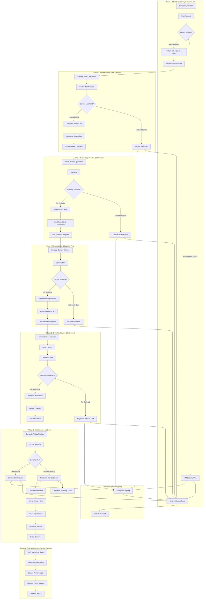

```mermaid
graph TD
    %% --- PHASE 1: INITIALIZATION & DISCOVERY ---
    subgraph subgraph_init_session["Phase 1: Identity Discovery & Session Init"]
        %% Hub & Spoke Enforcement
        EntranceInit["Initiate Registration"]
        UserAuth["User Account"]
        IAMCheck{"Identity Verified?"}
        SessionToken["Authenticated Session Token"]
        ExitInit["Initiated Session State"]

        EntranceInit --> UserAuth
        UserAuth --> IAMCheck
        IAMCheck -- No Validation Failure --> IAMAlert["IAM Security Alert"]
        IAMCheck -- Yes Validated --> SessionToken
        SessionToken --> ExitInit
        IAMAlert --> GlobalClosure
    end

    %% --- PHASE 2: LOCATION & CURATION ---
    subgraph subgraph_loc_zone["Phase 2: Geolocation & Zone Curation"]
        %% Hub & Spoke Enforcement
        EntranceLoc["Request GPS Coordinates"]
        GeoReq["Geolocation Request"]
        ZoneCheck{"Service Area Valid?"}
        DeliveryPin["Confirmed Delivery Pin"]
        ServiceFee["Applicable Service Fee"]
        ExitLoc["Zone Curation Complete"]

        ExitInit --> EntranceLoc
        EntranceLoc --> GeoReq
        GeoReq --> ZoneCheck
        ZoneCheck -- No Invalid Zone --> GeoAlert["Service Area Alert"]
        ZoneCheck -- Yes Validated --> DeliveryPin
        DeliveryPin --> ServiceFee
        ServiceFee --> ExitLoc
        GeoAlert --> GlobalClosure
    end

    %% --- PHASE 3: INVENTORY & CART CURATION ---
    subgraph subgraph_cart_stock["Phase 3: Inventory Check & Cart Curation"]
        %% Hub & Spoke Enforcement
        EntranceCart["Select Items & Quantities"]
        CartItem["Cart Item"]
        StockCheck{"Inventory Available?"}
        UpdatedCart["Updated Cart State"]
        RealTimeStock["Real-Time Stock Confirmation"]
        ExitCart["Cart Curation Complete"]

        ExitLoc --> EntranceCart
        EntranceCart --> CartItem
        CartItem --> StockCheck
        StockCheck -- No Out of Stock --> StockAlert["Stock Availability Alert"]
        StockCheck -- Yes Available --> UpdatedCart
        UpdatedCart --> RealTimeStock
        RealTimeStock --> ExitCart
        StockAlert --> GlobalClosure
    end

    %% --- PHASE 4: SLOT ALLOCATION & LOGISTICS ---
    subgraph subgraph_slot_logistics["Phase 4: Slot Allocation & Logistics Prep"]
        %% Hub & Spoke Enforcement
        EntranceSlot["Request Delivery Window"]
        DeliverySlot["Delivery Slot"]
        DispCheck{"Courier Available?"}
        AssignedSlot["Assigned Pickup/Delivery"]
        CourierID["Assigned Courier ID"]
        ExitSlot["Logistics Prep Complete"]

        ExitCart --> EntranceSlot
        EntranceSlot --> DeliverySlot
        DeliverySlot --> DispCheck
        DispCheck -- No Courier Busy --> SlotAlert["Slot Allocation Alert"]
        DispCheck -- Yes Available --> AssignedSlot
        AssignedSlot --> CourierID
        CourierID --> ExitSlot
        SlotAlert --> GlobalClosure
    end

    %% --- PHASE 5: ORDER FINALIZATION & SETTLEMENT ---
    subgraph subgraph_final_order["Phase 5: Order Finalization & Settlement"]
        %% Hub & Spoke Enforcement
        EntranceOrder["Submit Order & Payment"]
        OrderHeader["Order Header"]
        LineItem["Order Line Item"]
        PaymentAuth{"Payment Authorized?"}
        PaymentTrans["Payment Transaction"]
        OrderReceipt["Unique Order ID"]
        ExitOrder["Order Finalized"]

        ExitSlot --> EntranceOrder
        EntranceOrder --> OrderHeader
        OrderHeader --> LineItem
        LineItem --> PaymentAuth
        PaymentAuth -- No Declined --> PayAlert["Payment Declined Alert"]
        PaymentAuth -- Yes Authorized --> PaymentTrans
        PaymentTrans --> OrderReceipt
        OrderReceipt --> ExitOrder
        PayAlert --> GlobalClosure
    end

    %% --- PHASE 6: FULFILLMENT & HANDOVER ---
    subgraph subgraph_fulfill_handover["Phase 6: Fulfillment & Handover"]
        %% Hub & Spoke Enforcement
        EntrancePickup["Generate Pickup Manifest"]
        PickupManifest["Pickup Manifest"]
        ItemVerify{"Items Verified?"}
        MerchantStock["Merchant Inventory Stock"]
        CollectedItems["Collected Items List"]
        CourierTask["Active Delivery Task"]
        CourierOpt["Route Optimization"]
        HandoverRec["Handover Receipt"]
        ExitFulfill["Order Delivered"]

        ExitOrder --> EntrancePickup
        EntrancePickup --> PickupManifest
        PickupManifest --> ItemVerify
        ItemVerify -- No Item Missing --> StockDeduct["Execute Batch Deduction"]
        StockDeduct --> MerchantStock
        ItemVerify -- Yes Missing --> CancelReq["Cancellation Request"]
        StockDeduct --> CollectedItems
        CollectedItems --> CourierTask
        CourierTask --> CourierOpt
        CourierOpt --> HandoverRec
        HandoverRec --> ExitFulfill
        CancelReq --> GlobalClosure
    end

    %% --- PHASE 7: POST-SETTLEMENT & FINALIZATION ---
    subgraph subgraph_post_settle["Phase 7: Post-Settlement & Record Creation"]
        %% Hub & Spoke Enforcement
        EntrancePost["Verify Authorized Status"]
        FinalInvoice["Digital Invoice Record"]
        LoyaltyLedger["Loyalty Points Ledger"]
        PointsUpdate["Updated Points Balance"]
        ExitPost["System Closure"]

        ExitFulfill --> EntrancePost
        EntrancePost --> FinalInvoice
        FinalInvoice --> LoyaltyLedger
        LoyaltyLedger --> PointsUpdate
        PointsUpdate --> ExitPost
    end

    %% --- GLOBAL EXCEPTION HANDLING ---
    subgraph subgraph_global_closure["Global Exception Handling"]
        EntranceExcep["Exception Logging"]
        GlobalClosure["System Closure Node"]
        ExitExcep["Error Terminated"]

        IAMAlert --> EntranceExcep
        GeoAlert --> EntranceExcep
        StockAlert --> EntranceExcep
        PayAlert --> EntranceExcep
        CancelReq --> EntranceExcep
        EntranceExcep --> GlobalClosure
        GlobalClosure --> ExitExcep
    end

    %% --- STYLING REMOVAL NOTE ---
    %% No colors or styles applied as per strict instruction 12.
```