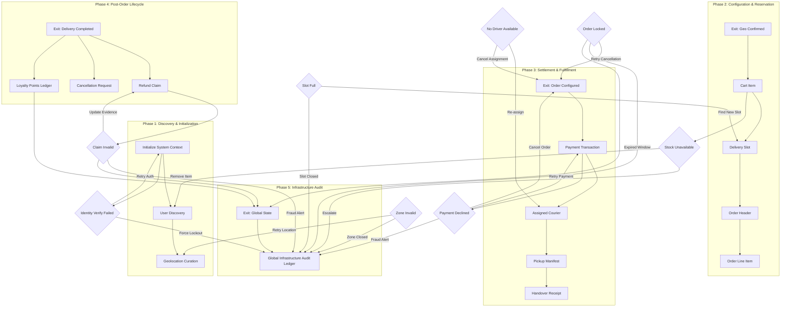

```mermaid
graph TD
    %% -----------------------------------------------------------------------------
    %% SUBGRAPH 1: INITIALIZATION & DISCOVERY LAYER
    %% -----------------------------------------------------------------------------
    subgraph subgraph_01 [Phase 1: Discovery & Initialization]
        %% Entrance
        init_entry[Initialize System Context]
        
        %% Discovery & Curation (Mandatory Layer 7)
        disc_user[User Discovery]
        disc_geo[Geolocation Curation]
        
        %% Logic Flow
        init_entry --> disc_user
        disc_user --> disc_geo
    end

    %% -----------------------------------------------------------------------------
    %% SUBGRAPH 2: INVENTORY & ORDER CONFIGURATION
    %% -----------------------------------------------------------------------------
    subgraph subgraph_02 [Phase 2: Configuration & Reservation]
        %% Entrance Node (Links from Exit of subgraph_01)
        subgraph_01_exit[Exit: Geo Confirmed]
        
        %% Core Entities
        cart_item[Cart Item]
        delivery_slot[Delivery Slot]
        order_header[Order Header]
        order_line_item[Order Line Item]
        
        %% Logic Flow
        subgraph_01_exit --> cart_item
        cart_item --> delivery_slot
        delivery_slot --> order_header
        order_header --> order_line_item
    end

    %% -----------------------------------------------------------------------------
    %% SUBGRAPH 3: PAYMENT & LOGISTICS HANDOVER
    %% -----------------------------------------------------------------------------
    subgraph subgraph_03 [Phase 3: Settlement & Fulfillment]
        %% Entrance Node
        subgraph_02_exit[Exit: Order Configured]
        
        %% Core Entities
        payment_txn[Payment Transaction]
        assigned_courier[Assigned Courier]
        pickup_manifest[Pickup Manifest]
        handover_receipt[Handover Receipt]
        
        %% Logic Flow
        subgraph_02_exit --> payment_txn
        payment_txn --> assigned_courier
        assigned_courier --> pickup_manifest
        pickup_manifest --> handover_receipt
    end

    %% -----------------------------------------------------------------------------
    %% SUBGRAPH 4: POST-DELIVERY & EXCEPTION MANAGEMENT
    %% -----------------------------------------------------------------------------
    subgraph subgraph_04 [Phase 4: Post-Order Lifecycle]
        %% Entrance Node
        subgraph_03_exit[Exit: Delivery Completed]
        
        %% Core Entities
        refund_claim[Refund Claim]
        cancellation_req[Cancellation Request]
        loyalty_pts[Loyalty Points Ledger]
        
        %% Logic Flow
        subgraph_03_exit --> refund_claim
        subgraph_03_exit --> cancellation_req
        subgraph_03_exit --> loyalty_pts
    end

    %% -----------------------------------------------------------------------------
    %% SUBGRAPH 5: GLOBAL INFRASTRUCTURE AUDIT LEDGER (Exception Sink)
    %% -----------------------------------------------------------------------------
    subgraph subgraph_05 [Phase 5: Infrastructure Audit]
        %% Entrance Node
        subgraph_04_exit[Exit: Global State]
        
        %% Exception Sink
        global_audit[Global Infrastructure Audit Ledger]
        subgraph_04_exit --> global_audit
    end

    %% -----------------------------------------------------------------------------
    %% CROSS-SUBGRAPH EXCEPTION & VALIDATION FLOW (Loopbacks)
    %% -----------------------------------------------------------------------------

    %% --- SUBGRAPH 1 EXCEPTIONS ---
    disc_user_fail{Identity Verify Failed}
    disc_geo_fail{Zone Invalid}
    
    init_entry --> disc_user_fail
    disc_user_fail -- "Retry Auth" --> init_entry
    disc_user_fail -- "Force Lockout" --> global_audit
    disc_geo_fail -- "Retry Location" --> disc_geo
    disc_geo_fail -- "Zone Closed" --> global_audit

    %% --- SUBGRAPH 2 EXCEPTIONS ---
    cart_item_fail{Stock Unavailable}
    delivery_slot_fail{Slot Full}
    
    cart_item --> cart_item_fail
    cart_item_fail -- "Remove Item" --> disc_user
    cart_item_fail -- "Escalate" --> global_audit
    
    delivery_slot_fail -- "Find New Slot" --> delivery_slot
    delivery_slot_fail -- "Slot Closed" --> global_audit

    %% --- SUBGRAPH 3 EXCEPTIONS ---
    payment_txn_fail{Payment Declined}
    assigned_courier_fail{No Driver Available}
    
    payment_txn --> payment_txn_fail
    payment_txn_fail -- "Retry Payment" --> payment_txn
    payment_txn_fail -- "Cancel Order" --> subgraph_02_exit
    payment_txn_fail -- "Fraud Alert" --> global_audit
    
    assigned_courier_fail -- "Re-assign" --> assigned_courier
    assigned_courier_fail -- "Cancel Assignment" --> subgraph_02_exit

    %% --- SUBGRAPH 4 EXCEPTIONS ---
    refund_claim_fail{Claim Invalid}
    cancellation_req_fail{Order Locked}
    
    refund_claim --> refund_claim_fail
    refund_claim_fail -- "Update Evidence" --> refund_claim
    refund_claim_fail -- "Fraud Alert" --> global_audit
    
    cancellation_req_fail -- "Retry Cancellation" --> subgraph_02_exit
    cancellation_req_fail -- "Expired Window" --> global_audit

    %% -----------------------------------------------------------------------------
    %% LINKAGE: EXIT NODES TO AUDIT SINK
    %% -----------------------------------------------------------------------------
    refund_claim_fail --> subgraph_04_exit
    cancellation_req_fail --> subgraph_04_exit
    loyalty_pts --> subgraph_04_exit
```