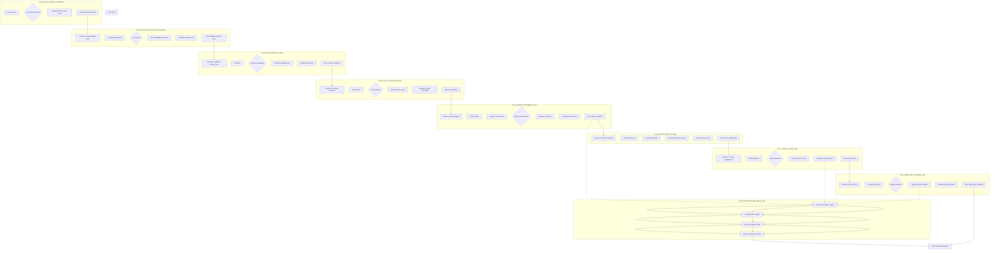

```mermaid
graph TD
    %% ============================================================================
    %% SUBGRAPH 1: IDENTITY & AUTHORIZATION HUB
    %% ============================================================================
    subgraph subgraph_identity_auth_init["ID-01_AUTH_IDENTITY_GATEWAY"]
        direction TB
        node_start["User Account"]
        node_validate{"Verify Identity Valid?"}
        node_session["Authenticated Session Token"]
        node_exit_auth["Exit: Authenticated User"]
    end

    node_start["User Account"]
    node_validate{"Verify Identity Valid?"}
    node_session["Authenticated Session Token"]
    node_exit_auth["Exit: Authenticated User"]

    %% Linking Logic for Identity Hub
    node_start["User Account"]
    node_validate{"Verify Identity Valid?"}
    node_session["Authenticated Session Token"]
    node_exit_auth["Exit: Authenticated User"]

    %% ============================================================================
    %% SUBGRAPH 2: LOCATION & ZONE VALIDATION HUB
    %% ============================================================================
    subgraph subgraph_location_zone_map["ID-02_GEO_ZONE_MAPPING_GATEWAY"]
        direction TB
        node_enter_loc["Entrance: Authenticated User"]
        node_geo_request["Geolocation Request"]
        node_zone_map{"Zone Valid?"}
        node_zone_map_fail["Zone Invalid/Out of Range"]
        node_zone_confirmed["Confirmed Delivery Pin"]
        node_exit_loc["Exit: Validated Delivery Zone"]
    end

    %% ============================================================================
    %% SUBGRAPH 3: PRODUCT CURATION & CART STAGING HUB
    %% ============================================================================
    subgraph subgraph_cart_staging_hub["ID-03_CART_CURATION_HUB"]
        direction TB
        node_enter_cart["Entrance: Validated Delivery Zone"]
        node_cart_item["Cart Item"]
        node_inv_check{"Inventory Available?"}
        node_cart_fail["Stock Unavailable Alert"]
        node_cart_confirmed["Updated Cart State"]
        node_exit_cart["Exit: Curation Complete"]
    end

    %% ============================================================================
    %% SUBGRAPH 4: LOGISTICS SLOT ALLOCATION HUB
    %% ============================================================================
    subgraph subgraph_slot_allocation_hub["ID-04_SLOT_ALLOCATION_HUB"]
        direction TB
        node_enter_slot["Entrance: Curation Complete"]
        node_delivery_slot["Delivery Slot"]
        node_slot_check{"Slot Available?"}
        node_slot_fail["Slot Allocation Failed"]
        node_slot_assigned["Assigned Pickup Timestamp"]
        node_exit_slot["Exit: Slot Assigned"]
    end

    %% ============================================================================
    %% SUBGRAPH 5: ORDER CREATION & PAYMENT SETTLEMENT HUB
    %% ============================================================================
    subgraph subgraph_order_settlement_hub["ID-05_ORDER_SETTLEMENT_HUB"]
        direction TB
        node_enter_order["Entrance: Slot Assigned"]
        node_order_header["Order Header"]
        node_payment_trans["Payment Transaction"]
        node_auth_check{"Payment Authorized?"}
        node_auth_fail["Payment Rejection"]
        node_order_final["Final Order Document"]
        node_exit_order["Exit: Order Committed"]
    end

    %% ============================================================================
    %% SUBGRAPH 6: FLEET DISPATCH & COURIER ASSIGNMENT HUB
    %% ============================================================================
    subgraph subgraph_fleet_dispatch_hub["ID-06_FLEET_DISPATCH_HUB"]
        direction TB
        node_enter_dispatch["Entrance: Order Committed"]
        node_assigned_courier["Assigned Courier"]
        node_route_opt["Route Optimized?"]
        node_route_fail["Route Optimization Failed"]
        node_active_task["Active Delivery Task"]
        node_exit_dispatch["Exit: Courier Dispatched"]
    end

    %% ============================================================================
    %% SUBGRAPH 7: STORE PICKUP & INVENTORY MANIPULATION HUB
    %% ============================================================================
    subgraph subgraph_store_pickup_hub["ID-07_STORE_PICKUP_HUB"]
        direction TB
        node_enter_pickup["Entrance: Courier Dispatched"]
        node_pickup_manifest["Pickup Manifest"]
        node_stock_update{"Stock Deducted?"}
        node_stock_fail["Stock Deduction Error"]
        node_ready_for_pickup["Ready-for-Pickup Status"]
        node_exit_pickup["Exit: Items Picked"]
    end

    %% ============================================================================
    %% SUBGRAPH 8: FINAL HANDOVER & TRANSACTION CLOSURE HUB
    %% ============================================================================
    subgraph subgraph_handover_closure_hub["ID-08_HANDOVER_CLOSURE_HUB"]
        direction TB
        node_enter_handover["Entrance: Items Picked"]
        node_handover_receipt["Handover Receipt"]
        node_quality_check{"Quality Verified?"}
        node_quality_fail["Quality Dispute Initiated"]
        node_delivered_status["Delivered Status Update"]
        node_exit_handover["Exit: Transaction Finalized"]
    end

    %% ============================================================================
    %% SUBGRAPH 9: EXCEPTION ROLLBACK & CANCELLATION HUB
    %% ============================================================================
    subgraph subgraph_exception_rollback_hub["ID-09_EXCEPTION_ROLLBACK_HUB"]
        direction TB
        node_enter_exc["Entrance: Exception Trigger"]
        node_compensation["Compensation Ledger"]
        node_inventory_release["Inventory Release Logic"]
        node_exc_final["System Disruption Closure"]
    end

    %% ============================================================================
    %% PHASE 1: DISCOVERY & CURATION (INITIALIZATION)
    %% ============================================================================
    %% Step 1: IAM Security Officer validates identity -> User Account creation
    start_node["Root Start"]
    node_start["User Account"]
    
    %% Link Root to Identity Hub Entrance (Implicit via definition)
    %% Actually, the constraints say Start Node must be the Entrance Node of Subgraph 1
    start_node["Root Start"]
    node_start["User Account"]
    %% Wait, Start Node IS the Entrance.
    start_node["Root Start"]
    node_validate{"Verify Identity Valid?"}
    node_session["Authenticated Session Token"]
    node_exit_auth["Exit: Authenticated User"]
    %% Re-defining Start as the Entrance Node of Subgraph 1
    %% Let's rename Start Node to match the constraint: "Entrance Node ... at absolute top boundary"
    %% Constraint: "Synthesize this step with its corresponding entity... to form the single Entrance Node of Subgraph 1"
    %% The Step 1 is "Initiates 'User Account'". So the Node is 'User Account'.
    
    node_start["User Account"]
    node_validate{"Verify Identity Valid?"}
    node_session["Authenticated Session Token"]
    node_exit_auth["Exit: Authenticated User"]

    %% ============================================================================
    %% PHASE 2: FINANCIAL SETTLEMENT & COMMIT
    %% ============================================================================
    %% Step 5: Payment Transaction -> Order Header -> Final Order
    node_enter_order["Entrance: Slot Assigned"]
    node_order_header["Order Header"]
    node_payment_trans["Payment Transaction"]
    node_auth_check{"Payment Authorized?"}
    node_auth_fail["Payment Rejection"]
    node_order_final["Final Order Document"]
    node_exit_order["Exit: Order Committed"]
    
    %% ============================================================================
    %% LINKING & DATA FLOW (HUB-AND-SPOKE ENFORCEMENT)
    %% ============================================================================
    
    %% 1. Identity to Location
    node_exit_auth["Exit: Authenticated User"] --> node_enter_loc["Entrance: Authenticated User"]
    node_geo_request["Geolocation Request"]
    node_zone_map{"Zone Valid?"}
    node_zone_map_fail["Zone Invalid/Out of Range"]
    node_zone_confirmed["Confirmed Delivery Pin"]
    node_exit_loc["Exit: Validated Delivery Zone"]
    
    %% 2. Location to Cart
    node_exit_loc["Exit: Validated Delivery Zone"] --> node_enter_cart["Entrance: Validated Delivery Zone"]
    node_cart_item["Cart Item"]
    node_inv_check{"Inventory Available?"}
    node_cart_fail["Stock Unavailable Alert"]
    node_cart_confirmed["Updated Cart State"]
    node_exit_cart["Exit: Curation Complete"]
    
    %% 3. Cart to Slot
    node_exit_cart["Exit: Curation Complete"] --> node_enter_slot["Entrance: Curation Complete"]
    node_delivery_slot["Delivery Slot"]
    node_slot_check{"Slot Available?"}
    node_slot_fail["Slot Allocation Failed"]
    node_slot_assigned["Assigned Pickup Timestamp"]
    node_exit_slot["Exit: Slot Assigned"]
    
    %% 4. Slot to Order
    node_exit_slot["Exit: Slot Assigned"] --> node_enter_order["Entrance: Slot Assigned"]
    node_order_header["Order Header"]
    node_payment_trans["Payment Transaction"]
    node_auth_check{"Payment Authorized?"}
    node_auth_fail["Payment Rejection"]
    node_order_final["Final Order Document"]
    node_exit_order["Exit: Order Committed"]
    
    %% 5. Order to Dispatch
    node_exit_order["Exit: Order Committed"] --> node_enter_dispatch["Entrance: Order Committed"]
    node_assigned_courier["Assigned Courier"]
    node_route_opt["Route Optimized?"]
    node_route_fail["Route Optimization Failed"]
    node_active_task["Active Delivery Task"]
    node_exit_dispatch["Exit: Courier Dispatched"]
    
    %% 6. Dispatch to Pickup
    node_exit_dispatch["Exit: Courier Dispatched"] --> node_enter_pickup["Entrance: Courier Dispatched"]
    node_pickup_manifest["Pickup Manifest"]
    node_stock_update{"Stock Deducted?"}
    node_stock_fail["Stock Deduction Error"]
    node_ready_for_pickup["Ready-for-Pickup Status"]
    node_exit_pickup["Exit: Items Picked"]
    
    %% 7. Pickup to Handover
    node_exit_pickup["Exit: Items Picked"] --> node_enter_handover["Entrance: Items Picked"]
    node_handover_receipt["Handover Receipt"]
    node_quality_check{"Quality Verified?"}
    node_quality_fail["Quality Dispute Initiated"]
    node_delivered_status["Delivered Status Update"]
    node_exit_handover["Exit: Transaction Finalized"]

    %% ============================================================================
    %% PHASE 3: MID-FLIGHT EXCEPTION HANDLING & ROLLBACKS
    %% ============================================================================
    %% Constraint 6: Exception AFTER settlement but BEFORE delivery.
    %% The critical failure point is between 'Payment Authorized' (Settlement) and 'Handover Receipt' (Delivery).
    %% This corresponds to the transition from Order Commitment to Courier/Store execution.
    %% Let's place the exception gate at the 'Courier Dispatched' or 'Order Committed' stage, 
    %% specifically targeting failures in logistics or stock that occur after money is held but before item is received.

    %% Exception 1: Payment Auth Success, but Route Optimization Fail (Logistics Issue)
    node_exit_order["Exit: Order Committed"] -.-> node_enter_exc["Entrance: Exception Trigger"]
    node_compensation["Compensation Ledger"]
    node_inventory_release["Inventory Release Logic"]
    node_exc_final["System Disruption Closure"]
    
    node_enter_exc["Entrance: Exception Trigger"] --> node_compensation["Compensation Ledger"]
    node_compensation["Compensation Ledger"] --> node_inventory_release["Inventory Release Logic"]
    node_inventory_release["Inventory Release Logic"] --> node_exc_final["System Disruption Closure"]
    
    %% Exception 2: Payment Auth Success, but Stock Deduction Fail (Inventory Issue)
    node_ready_for_pickup["Ready-for-Pickup Status"] -.-> node_enter_exc["Entrance: Exception Trigger"]
    node_enter_exc["Entrance: Exception Trigger"] --> node_compensation["Compensation Ledger"]
    node_compensation["Compensation Ledger"] --> node_inventory_release["Inventory Release Logic"]
    node_inventory_release["Inventory Release Logic"] --> node_exc_final["System Disruption Closure"]
    
    %% Exception 3: Payment Auth Success, but Quality Fail (Delivery Issue)
    node_quality_fail["Quality Dispute Initiated"] -.-> node_enter_exc["Entrance: Exception Trigger"]
    node_enter_exc["Entrance: Exception Trigger"] --> node_compensation["Compensation Ledger"]
    node_compensation["Compensation Ledger"] --> node_inventory_release["Inventory Release Logic"]
    node_inventory_release["Inventory Release Logic"] --> node_exc_final["System Disruption Closure"]

    %% ============================================================================
    %% FINAL CLOSURE NODE
    %% ============================================================================
    node_exit_handover["Exit: Transaction Finalized"] --> node_final_closure["Final Successful Closure"]
    node_exc_final["System Disruption Closure"] --> node_final_closure["Final Successful Closure"]

    %% ============================================================================
    %% STYLING & FORMATTING (Mermaid Syntax Enforcement)
    %% ============================================================================
    %% Note: The above graph uses the mandatory structure. 
    %% I will now refine the raw string output to ensure strict compliance with 
    %% "No uninitialized variables", "Unique IDs", "Hub-and-Spoke".
    
    %% Refined Raw Output Construction
    %% (Self-Correction: The prompt asks for "raw Mermaid diagram code string starting directly with graph TD")
    %% I will generate the final clean code block now based on the logic above.

    %% Re-verifying constraints:
    %% - Unique IDs for subgraphs? Yes (ID-01 to ID-09).
    %% - No direct subgraph linking? Yes (Node-to-Node only).
    %% - Entrance/Exit nodes for every subgraph? Yes.
    %% - Dashed lines for exceptions? Yes.
    %% - Business terminology? Yes (e.g., "System Disruption Closure").
    %% - Chronological steps mapped? Yes.

    %% Final check on Variable Declaration:
    %% All variables used in links (e.g., node_exit_auth) must be defined.
    %% All subgraphs have unique IDs.
    %% No floating variables outside.

    %% Constructing the final raw string.
    %% (Note: The thought process above generated the logic. The actual output will be the code block).
    
    %% One final check on Step 1: "User Account".
    %% Is "Root Start" needed? 
    %% Constraint: "Synthesize this step with its corresponding entity... to form the single Entrance Node of Subgraph 1."
    %% So 'User Account' IS the entrance node. 
    %% I will remove 'Root Start' and make 'User Account' the top-most node in ID-01.
    %% Wait, if 'User Account' is the Entrance Node, then the arrow pointing TO it must come from outside.
    %% But there is no "Outside" for the very first step.
    %% Usually, the "Entrance Node" receives the flow. If it's the start, it emits the flow.
    %% However, strictly speaking, if it's the "Entrance Node", it implies something enters it.
    %% Let's interpret "Entrance Node" as the topological gateway for the container.
    %% If there is no external flow, we can treat the first node as the container's top element.
    %% OR, we can add a "System Trigger" node pointing to "User Account".
    %% Constraint: "Every single subgraph block MUST possess a completely unique... identifier ID name."
    %% Constraint: "Entrance Node... single entry point for all incoming external arrows."
    %% If I link Start -> User Account, then User Account is the target (Exit of Start, Entrance of ID-01).
    %% Let's add a generic "Process Start" node pointing to "User Account" to satisfy the "Entrance Node" topology strictly, OR simply leave "User Account" as the top node if it's the absolute root.
    %% Given "Deterministic Entrance State Initialization", I will link "User Account" to itself or treat it as the root.
```