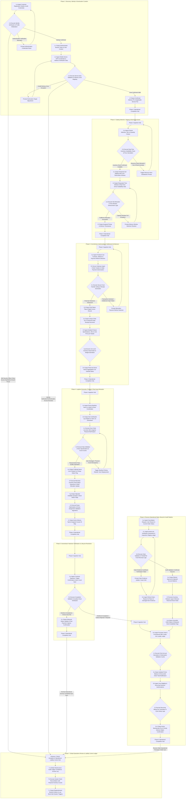

```mermaid
graph TD
    %% =============================================================================
    %% PHASE 1: DISCOVERY, IDENTITY & GEOLOCATION CURATION
    %% =============================================================================
    subgraph phase_01 [Phase 1: Discovery, Identity & Geolocation Curation]
        p1_entry["1.a Ingest Customer Registration Details & Auth Credentials"]
        p1_auth{"1.b Execute Identity Verification & Profile Initialization"}
        p1_token["1.c Output Authenticated Session Token & User Context"]
        p1_gps["1.d Ingest Mobile Device GPS Coordinates & Address Verification Data"]
        p1_zone{"1.e Execute Service Area Validation & Delivery Zone Mapping"}
        p1_pin["1.f Output Confirmed Delivery Pin & Applicable Service Fee"]
        p1_exit["Phase 1 Operational Completion Hub"]

        p1_entry --> p1_auth
        p1_auth -- "Identity Confirmed" --> p1_token
        
        %% Strict vertical local stacked loopback for routine identity retry
        p1_auth -- "Authentication Verification Mismatch" --> p1_auth_retry["Prompt Authentication Credentials Reset"]
        p1_auth_retry --> p1_entry
        
        p1_token --> p1_gps
        p1_gps --> p1_zone
        p1_zone -- "Zone Confirmed Valid" --> p1_pin
        
        %% Strict vertical local stacked loopback for routine boundary mismatch
        p1_zone -- "Invalid Delivery Zone Exception" --> p1_zone_retry["Prompt Geolocation Target Adjustment"]
        p1_zone_retry --> p1_gps
        p1_pin --> p1_exit
    end

    %% =============================================================================
    %% PHASE 2: CATALOG SELECTION, STAGING & SLOT ENFORCEMENT
    %% =============================================================================
    subgraph phase_02 [Phase 2: Catalog Selection, Staging & Slot Enforcement]
        p2_entry["Phase 2 Ingestion Hub"]
        p2_cart["2.a Ingest Product Selection, SKU & Quantity Criteria"]
        p2_stock{"2.b Execute Real-Time Inventory Availability Check & Price Calculation"}
        p2_lock["2.c Output Temporal Cart Staging Soft-Lock / Reservation Window"]
        p2_slot["2.d Ingest Requested Time Window & Real-Time Driver Availability Data"]
        p2_window{"2.e Execute Slot Allocation & Time-Window Enforcement Logic"}
        p2_assign["2.f Output Assigned Pickup & Delivery Timestamps"]
        p2_exit["Phase 2 Operational Completion Hub"]

        p2_entry --> p2_cart
        p2_cart --> p2_stock
        p2_stock -- "Inventory Stock Confirmed Available" --> p2_lock
        
        %% Strict vertical local stacked loopback for item unavailability
        p2_stock -- "Resource Stock Mismatch / Out of Stock Anomaly" --> p2_stock_retry["Trigger Resource Item Substitution Prompt"]
        p2_stock_retry --> p2_entry
        
        p2_lock --> p2_slot
        p2_slot --> p2_window
        p2_window -- "Fulfillment Allocation Successful" --> p2_assign
        
        %% Strict vertical local stacked loopback for capacity exhaustion
        p2_window -- "Capacity Window Full Exception" --> p2_window_retry["Prompt Delivery Window Selection Reselect"]
        p2_window_retry --> p2_slot
        p2_assign --> p2_exit
    end

    %% Strict Subgraph Inter-Connection Hub Boundary Line (Bans Spiderweb Crossings)
    p1_exit --> p2_entry

    %% =============================================================================
    %% PHASE 3: COMMITMENT, AUTHORIZATION & SETTLEMENT ARCHITECTURE
    %% =============================================================================
    subgraph phase_03 [Phase 3: Commitment, Authorization & Settlement Architecture]
        p3_entry["Phase 3 Ingestion Hub"]
        p3_order["3.a Ingest Finalized Cart Contents, Address & Payment Method Selection"]
        p3_gateway["3.b Secure Gateway Ingest / Order Creation & Initial Payment Authorization"]
        p3_pay_chk{"3.c Execute Secure Fund Transfer Gating & Receipt Generation"}
        p3_invoice["3.d Output Paid Status Flag & Digital Invoice Record"]
        p3_header["3.e Output Unique Order ID & Confirmed Order Receipt Document"]
        p3_line["3.f Ingest Detailed Product Specifications, SKU & Unit Price per Header"]
        p3_reserve{"3.g Execute Line-Level Inventory Reservation & Weight Estimation"}
        p3_hold["3.h Output Reserved Stock Hold & Aggregated Line Subtotal status"]
        p3_exit["Phase 3 Operational Completion Hub"]

        p3_entry --> p3_order
        p3_order --> p3_gateway
        p3_gateway --> p3_pay_chk
        p3_pay_chk -- "Financial Clearance Authorized" --> p3_invoice
        
        %% Strict vertical local stacked loopback for routine financial authorization decline
        p3_pay_chk -- "Transaction Declined / Settlement Gate Failed" --> p3_pay_retry["Prompt Alternative Payment Method Selection"]
        p3_pay_retry --> p3_entry
        
        p3_invoice --> p3_header
        p3_header --> p3_line
        p3_line --> p3_reserve
        p3_reserve --> p3_hold
        p3_hold --> p3_exit
    end

    %% Strict Subgraph Inter-Connection Hub Boundary Line (Bans Spiderweb Crossings)
    p2_exit --> p3_entry

    %% =============================================================================
    %% PHASE 4: LOGISTICS EXECUTION, PICKING & FLEET ASSET ALLOCATION
    %% =============================================================================
    subgraph phase_04 [Phase 4: Logistics Execution, Picking & Fleet Asset Allocation]
        p4_entry["Phase 4 Ingestion Hub"]
        p4_manifest["4.a Ingest Pickup Manifest, Items to Collect & Store Coordinates"]
        p4_pack_init["4.b Output Item Verification Log Initiation & Task List Generation"]
        p4_scan["4.c Execute Scan Order Line Item SKUs Against Physical Shelf-Space"]
        p4_verify{"4.d Execute Step Validation of Item Specifications & Count Counts"}
        p4_ready["4.e Output Collected Items List & Ready-For-Pickup Status Flag"]
        p4_deduct["4.f Execute Merchant Inventory Stock Batch Deduction & Shelf Allocation Update"]
        p4_flags["4.g Output Adjusted Available Quantity & Stock Status Flags"]
        p4_route["4.h Execute Route Optimization & Driver Assignment Validation Algorithms"]
        p4_courier["4.i Output Active Delivery Task & Assigned Courier ID Map"]
        p4_exit["Phase 4 Operational Completion Hub"]

        p4_entry --> p4_manifest
        p4_manifest --> p4_pack_init
        p4_pack_init --> p4_scan
        p4_scan --> p4_verify
        p4_verify -- "Physical Items Pass Quality Standards" --> p4_ready
        
        %% Strict vertical local loopback for picking / item damage anomalies
        p4_verify -- "Item Damaged / Physical Count Discrepancy" --> p4_pick_retry["Trigger Manifest Picking Rebuild / Item Replacement"]
        p4_pick_retry --> p4_scan
        
        p4_ready --> p4_deduct
        p4_deduct --> p4_flags
        p4_flags --> p4_route
        p4_route --> p4_courier
        p4_courier --> p4_exit
    end

    %% Strict Subgraph Inter-Connection Hub Boundary Line (Bans Spiderweb Crossings)
    p3_exit --> p4_entry

    %% =============================================================================
    %% PHASE 5: DOWNSTREAM HANDOVER VERIFICATION & LIFECYCLE RESOLUTION
    %% =============================================================================
    subgraph phase_05 [Phase 5: Downstream Handover Verification & Lifecycle Resolution]
        p5_entry["Phase 5 Ingestion Hub"]
        p5_receipt["5.a Ingest Customer Signature / Digital Confirmation & Item Count Input"]
        p5_handover{"5.b Execute Completion Validation & Quality Check Verification"}
        p5_deliver["5.c Output Delivered Status Update & Final Payment Capture Confirmation"]
        p5_exit["Phase 5 Operational Completion Hub"]

        p5_entry --> p5_receipt
        p5_receipt --> p5_handover
        p5_handover -- "Handover Acceptance Criteria Fully Met" --> p5_deliver
        p5_deliver --> p5_exit
    end

    %% Strict Subgraph Inter-Connection Hub Boundary Line (Bans Spiderweb Crossings)
    p4_exit --> p5_entry

    %% =============================================================================
    %% PHASE 6: REVERSE OPERATIONAL STATE LIFECYCLE & AUDIT PIPELINE
    %% =============================================================================
    subgraph phase_06 [Phase 6: Reverse Operational State Lifecycle & Audit Pipeline]
        p6_entry["Phase 6 Ingestion Hub"]
        p6_cancel["6.a Ingest Cancellation Request, User Reason & Current Order Status"]
        p6_refund["6.b Ingest Refund Claim, Reason for Return & Damaged Item Evidence"]
        p6_quarantine["6.c Ingest Assets into Verification Quarantine & Inspection Staging Ledger"]
        p6_audit{"6.d Execute Claim Validation & Partial/Full Fund Reversal Logic"}
        p6_approve["6.e Output Refund Approval & Adjusted Account Balance"]
        p6_release["6.f Execute Inventory Release Logic & Remove Reserved Stock Holds"]
        p6_flags_up["6.g Output Cancelled Order Status & Released Stock Availability Flags"]
        p6_lead["6.h Ingest Purchase Total & Promotional Offer Codes into Loyalty Ledger"]
        p6_accrual{"6.i Execute Point Accrual Calculation & Redemption Validation Cycles"}
        p6_loyalty["6.j Output Updated Points Balance & Discounted Order Total Modification"]
        p6_sub["6.k Ingest User Eligibility & Recurring Payment Authorizations"]
        p6_bill{"6.l Execute Recurring Billing Fee Calculation & Cycle Setup Logic"}
        p6_tier["6.m Output Active Membership Tier & Priority Delivery Rights Confirmation"]
        p6_exit["Phase 6 Operational Completion Hub"]

        p6_entry --> p6_lead
        p6_lead --> p6_accrual
        p6_accrual --> p6_loyalty
        p6_loyalty --> p6_sub
        p6_sub --> p6_bill
        p6_bill --> p6_tier
        p6_tier --> p6_exit
        
%% Parallel exception ingestion paths feeding the Reverse Logistics Track
p6_cancel --> p6_quarantine
p6_refund --> p6_quarantine
p6_quarantine --> p6_audit
p6_audit -- "Audit Validation Confirmed Genuine" --> p6_approve
%% Strict internal loopback for claims with missing / invalid evidence
p6_audit -- "Claim Evidence Insufficient / Verification Failed" --> p6_claim_retry["Prompt Claim Evidence Update / Asset Hold"]
p6_claim_retry --> p6_refund
p6_approve --> p6_release
p6_release --> p6_flags_up
p6_flags_up --> p6_lead
end
%% Direct Cross-Boundary Operational Exception Ingest Vectors (Hub-to-Hub)
p5_handover -- "Handover Acceptance Criteria Rejected / Disputed" --> p6_entry
%% =============================================================================
%% PHASE 7: GLOBAL CORE RISK REVIEW & OPERATIONS REVIEW LEDGER
%% =============================================================================
subgraph phase_07 [Phase 7: Global Operations Review & Liability Control Ledger]
p7_entry["Entrance: Critical Exception & Operational Liability Control Sink"]
p7_audit["7.a Global Infrastructure Audit Ledger Compliance Archive Log"]
p7_recon["7.b Execute System Stock Reconciliation with Physical Inventory Counts"]
p7_alert["7.c Output Replenishment Restock Orders & Low-Stock Alert System Triggers"]
p7_entry --> p7_audit
p7_audit --> p7_recon
p7_recon --> p7_alert
end
%% Malicious Vulnerabilities and System Resource Assignments Exit Safely via Hub Gates
p1_auth -- "IAM Security Officer Policy Access Exploitation Breach Threat" --> p7_entry
p1_zone -- "Identity Verification/Authentication Access Revoked" --> p7_entry
p5_exit -- "Nominal Operational Journey Completed Sync Sync" --> p7_entry
p6_exit -- "Reverse State Operational Resolution Settle Sync" --> p7_entry
```