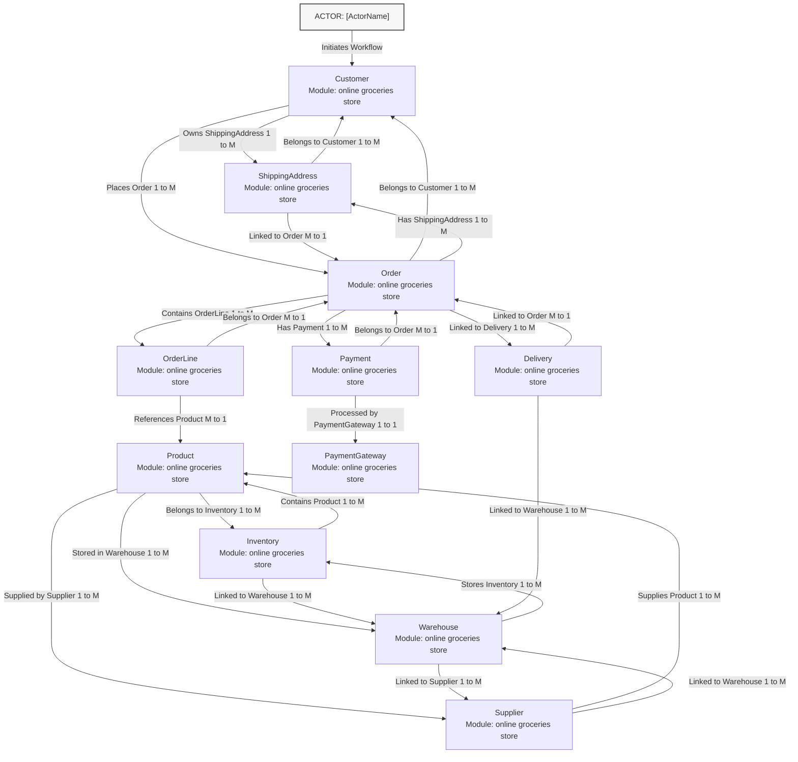

User:
You are an expert Systems Architect specializing in visual workflow layout notation. Your sole objective is to read the architectural JSON payload below and translate it into a perfectly formatted, clean, linear 'flowchart TD' Mermaid diagram.

STRICT VISUAL & REPETITION MANDATES:
1. CODE BLOCK INITIALIZATION: You MUST start the output with the literal markdown code block wrapper "```mermaid" on its own line.
2. FLOWCHART NOTATION: Directly below the wrapper line, write the literal keyword "flowchart TD" on its own line.
3. FORCE 4-SPACE INDENTATION: Every single line of code inside the diagram following "flowchart TD" MUST begin with exactly four leading spaces.
4. GRAPH COMPILATION CONSTRAINTS:
    - Include 'classDef actor fill:#f7f7f7,stroke:#555,stroke-width:2px;' as the first block configuration line.
    - Render the primary operational actor node at the top using uppercase 'A' variable name and bind the actor class directly to it using the clean inline suffix format: A["ACTOR: [ActorName]"]:::actor
    - MANDATORY ACTOR CONNECTION: You MUST explicitly connect the root actor node 'A' directly to the first core operational object identifier node using a labeled arrow link matching this exact format: A -->|"Initiates Workflow"| NODE_ID
    - Declare each unique object node exactly ONCE using a clean multiline layout format containing the entity name and its parent module name (e.g., NODE_ID["Object Name<br/>Module: Context Module"]).
    - Map out the directional paths based strictly on the unique object identifiers using labeled arrows: nodeA -->|"Action Label"| nodeB.
    - CRITICAL TEXT REPLACEMENT RULE: You are strictly FORBIDDEN from including the colon character ":" inside any arrow label text. If a relationship has a string layout like "Owns (1:M)", you MUST strip the colon or replace it with a space or dash (e.g., change it to "Owns 1 to M" or "Owns 1-M") to prevent the Mermaid parser from crashing.
    - ANTI-LOOP FILTER: You are strictly FORBIDDEN from mapping an edge relation path back onto the exact same node (e.g., do not output nodeA --> nodeA), and you are strictly FORBIDDEN from repeating an identical directional relationship connection that has already been declared.
5. CODE BLOCK TERMINATION: You MUST close the diagram block by outputting the literal markdown code block enclosure "```" on its own line at the very end of the file.
6. NO EXTRA CHATTER: Do not write explanations, introductions, or conversational footnotes. Output the markdown diagram syntax text directly.

[SOURCE ARCHITECTURE PAYLOAD]:
{
  "CORE_DOMAIN": "online groceries store",
  "BusinessObjectsDeepArchitecture": [
    {
      "BusinessObjectName": "Customer",
      "PrimaryRelations": [
        "Owns ShippingAddress (1:M)",
        "Places Order (1:M)"
      ],
      "KeyStateTransitions": [
        "Registered -> Active -> Suspended -> Deleted"
      ]
    },
    {
      "BusinessObjectName": "Product",
      "PrimaryRelations": [
        "Belongs to Inventory (1:M)",
        "Supplied by Supplier (1:M)",
        "Stored in Warehouse (1:M)"
      ],
      "KeyStateTransitions": [
        "Created -> Available -> OutOfStock -> Discontinued"
      ]
    },
    {
      "BusinessObjectName": "Order",
      "PrimaryRelations": [
        "Belongs to Customer (1:M)",
        "Contains OrderLine (1:M)",
        "Has Payment (1:M)",
        "Has ShippingAddress (1:M)",
        "Linked to Delivery (1:M)"
      ],
      "KeyStateTransitions": [
        "Created -> Paid -> Processing -> Shipped -> Delivered -> Cancelled"
      ]
    },
    {
      "BusinessObjectName": "OrderLine",
      "PrimaryRelations": [
        "Belongs to Order (M:1)",
        "References Product (M:1)"
      ],
      "KeyStateTransitions": [
        "Created -> Confirmed -> Shipped -> Delivered"
      ]
    },
    {
      "BusinessObjectName": "Inventory",
      "PrimaryRelations": [
        "Contains Product (1:M)",
        "Linked to Warehouse (1:M)"
      ],
      "KeyStateTransitions": [
        "Initialized -> Stocked -> Depleted -> Replenished"
      ]
    },
    {
      "BusinessObjectName": "Supplier",
      "PrimaryRelations": [
        "Supplies Product (1:M)",
        "Linked to Warehouse (1:M)"
      ],
      "KeyStateTransitions": [
        "Registered -> Active -> Suspended -> Deleted"
      ]
    },
    {
      "BusinessObjectName": "Warehouse",
      "PrimaryRelations": [
        "Stores Inventory (1:M)",
        "Linked to Supplier (1:M)"
      ],
      "KeyStateTransitions": [
        "Initialized -> Operational -> Maintenance -> Decommissioned"
      ]
    },
    {
      "BusinessObjectName": "Payment",
      "PrimaryRelations": [
        "Belongs to Order (M:1)",
        "Processed by PaymentGateway (1:1)"
      ],
      "KeyStateTransitions": [
        "Initiated -> Approved -> Failed -> Refunded"
      ]
    },
    {
      "BusinessObjectName": "ShippingAddress",
      "PrimaryRelations": [
        "Belongs to Customer (1:M)",
        "Linked to Order (M:1)"
      ],
      "KeyStateTransitions": [
        "Created -> Valid -> Modified -> Deleted"
      ]
    },
    {
      "BusinessObjectName": "Delivery",
      "PrimaryRelations": [
        "Linked to Order (M:1)",
        "Linked to Warehouse (1:M)"
      ],
      "KeyStateTransitions": [
        "Scheduled -> InTransit -> Delivered -> Cancelled"
      ]
    }
  ]
}


Assistant:


